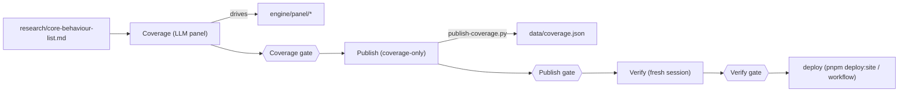

# .claude/skills/ — the LLM-facing procedure layer: coverage-only sweeps with human gates

> Current-state doc: describes what exists now, not what should exist. Brought current with the Phase-2 stack (#28–#34) and the scope ruling.

## Purpose

The agent-executable playbook for the coverage workflow — the primary LLM-facing interface to the repo. Scope ruling 2026-08-19: the evidence-discovery stages 1–3, the `behaviour-sweep` orchestrator, and `exclusion-criteria.md` were deleted, leaving the coverage-only procedure as the only workflow here. How to run a sweep — invocation, the stage and gate tables, where artifacts land — lives in `README.md`; this file maps the layer instead.

## Contents

| Path | What it is |
|---|---|
| `README.md` | Entry point: invoking a coverage sweep, the gate table, artifact layout under `research/sweeps/NN-<slug>/`. |
| `sweep-coverage/SKILL.md` | **LLM panel** grades every spec passage (drives `engine/panel/run_rollout.py`, `whole_doc.py`, `build_site_data.py`; cites `engine/spec-cite/cite.py`, `specs/CITATION.md`, `methodology/spec-coverage-depth-rubric.md`). Coverage gate: mechanical re-resolution with zero mismatches + human spot-read of unanimous-core passages. |
| `sweep-publish/SKILL.md` | Coverage-only publication: gate-approved coverage artifact → `data/coverage.json` via `engine/publish-coverage.py` (structured `spec-coverage.json` sidecar preferred, markdown fallback), plus the sweep write-up. Publish gate: human verifies every surface. |
| `sweep-verify/SKILL.md` | Fresh-context audit (quote re-resolution, gate log, live links) — must run in a NEW session. Verify gate: human signs sweep complete; then deploy (`pnpm deploy:site` or the auto-deploy workflow). |
| `spec-coverage-pass/SKILL.md` | Campaign wrapper: the coverage stage + the repo/reader slice of the publish stage for one behaviour, on a `sweep/NN-<slug>` branch merged by PR with per-step commits. Precedent: `research/sweeps/02-calibration/`. |
| `references/locations.md` | Spec versions and canonical paths (Notion IDs stripped by the scope pass). |

## Relationships

- Input: `research/core-behaviour-list.md` (the behaviour under sweep) + the `specs/` mirrors; outputs land in `research/sweeps/NN-<slug>/` artifacts (markdown + sidecar) and `data/coverage.json`.
- The coverage stage is the coupling point to the engine: it is the procedure around `engine/panel/` (config, dry-run/`--go`, substitution handling, timestamped runs + manifest, provenance) and to `specs/CITATION.md`'s locator grammar (including user-registered specs via `specs/user/specs.json`).
- The publish stage's repo writes flow through `engine/publish-coverage.py`, which prefers the schema-checked sidecar and falls back to regex-parsing the markdown — the artifact layout these skills prescribe is a de facto API.

## Dependency map

## As-is observations

- The artifact template the coverage stage points to (`research/sweeps/02-calibration/4-spec-coverage.md`, which predates the rename and keeps its original filename) contains a `## Term sweep` section the current procedure does not produce (the skill asks for "Panel run") — an agent copying the template reproduces a section the publisher does not ingest.
- The verify skill names manual `pnpm deploy:site` as THE release act and does not mention `.github/workflows/deploy.yml`, which auto-deploys on merge to main; both mechanisms exist.
- Resolved by the stack: the canonical panel runlog `engine/panel/runlog-v5.jsonl` is committed and documented (`runlog-v5.md`; the v3-era `runlog-v3.jsonl` stays committed with its record), its byte-identity is verified by `engine/panel/verify_panel_provenance.py`, and panel runtime artifacts (other runlogs, metrics, timestamped payloads, manifest) are gitignored.
