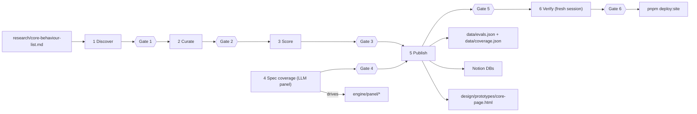

# .claude/skills/ — the LLM-facing procedure layer: staged behaviour sweeps with human gates

> As-is snapshot of origin/main @ 31fddca (2026-08-17). Describes what exists now, not what should exist.

## Purpose

The agent-executable playbook for extending the index: a six-stage "behaviour sweep" pipeline (plus two campaign wrappers), where each stage ends at a human sign-off gate. This is the primary LLM-facing interface to the repo — an agent asked to "sweep behaviour N" starts at `README.md` and follows these files.

## Contents

| Path | What it is |
|---|---|
| `README.md` | Entry point: invoking a sweep, the gate table, artifact layout under `research/sweeps/NN-<slug>/`. |
| `behaviour-sweep/SKILL.md` | Orchestrator: stage sequencing, gate protocol (render checklist with evidence → STOP → human signs `gates.md`), two tracks (evidence stages 1→2→3 in parallel with spec stage 4), publication order (stage 5 writes internal surfaces; public deploy only after Gate 6). |
| `1-sweep-discover/SKILL.md` | Fan agents over eval literature; dossiers + candidate register. Gate 1: evidence base real/complete; human spot-checks 2 candidates against primary sources. |
| `2-sweep-curate/SKILL.md` | Final disposition per candidate against pre-registered exclusion codes (`references/exclusion-criteria.md`). Gate 2: human confirms/overrides every disposition. |
| `3-sweep-score/SKILL.md` | 0–4 I/E/R rubric scoring + adherence extraction. Gate 3: human spot-audits one eval × dimension. |
| `4-sweep-spec-coverage/SKILL.md` | **LLM panel** grades every spec passage (drives `engine/panel/run_rollout.py`, `whole_doc.py`, `build_site_data.py`; cites `engine/spec-cite/cite.py`, `specs/CITATION.md`, `methodology/spec-coverage-depth-rubric.md`). Gate 4: mechanical re-resolution with zero mismatches + human spot-read of unanimous-core passages. |
| `5-sweep-publish/SKILL.md` | Transcribe gate-approved artifacts to three internal surfaces: repo data + write-up (`data/evals.json`, `data/coverage.json` via `engine/publish-coverage.py`), Notion (IDs in `references/locations.md`), prototype (`design/prototypes/core-page.html`). Gate 5: human verifies every surface. |
| `6-sweep-verify/SKILL.md` | Fresh-context audit (register accounting, score identity, live links, quote re-resolution, gate log) — must run in a NEW session. Gate 6: human signs sweep complete; then `pnpm deploy:site`. |
| `spec-coverage-pass/SKILL.md` | Campaign wrapper: stage 4 + the repo/reader slice of stage 5 for one behaviour, on a `sweep/NN-<slug>` branch merged by PR with per-step commits. Precedent: `research/sweeps/02-calibration/`. |
| `behaviour-sweep/references/` | `locations.md` (Notion page/DB IDs, spec versions, canonical paths — accurate against this checkout) and `exclusion-criteria.md`. |

## Relationships

- Input: `research/core-behaviour-list.md` (the behaviour under sweep); outputs land in `research/sweeps/NN-<slug>/` artifacts, `data/evals.json`, `data/coverage.json`, Notion, and the prototype page.
- Stage 4 is the coupling point to the engine: it is the procedure around `engine/panel/` (config, dry-run/`--go`, substitution handling, provenance sections) and to `specs/CITATION.md`'s locator grammar.
- Stage 5's repo writes flow through `engine/publish-coverage.py`, which regex-parses the stage-4 artifact format — the markdown layout these skills prescribe is a de facto API.

## Dependency map

## As-is observations

- Stage 4 fully describes the LLM panel (every path it names exists on this checkout), but the artifact template it points to (`research/sweeps/02-calibration/4-spec-coverage.md`) contains a `## Term sweep` section the current procedure does not produce (the skill asks for "Panel run") — an agent copying the template reproduces a section the publisher does not ingest.
- Stage 6 and the orchestrator name manual `pnpm deploy:site` as THE release act and do not mention `.github/workflows/deploy.yml`, which auto-deploys on merge to main; both mechanisms exist.
- `README.md`'s "`data/evals.json` `data/coverage.json` — what the site renders" is only partly true: the readers render engine-built payloads, `index.html` renders inline prototype data, and nothing renders `evals.json` yet.
- The runlog stage 4 names (`engine/panel/runlog-v3.jsonl`) is gitignored by design; the shipped copy lives on the `experiment/panel-judges` branch, so reproducing the shipped dataset requires a branch that isn't main.
