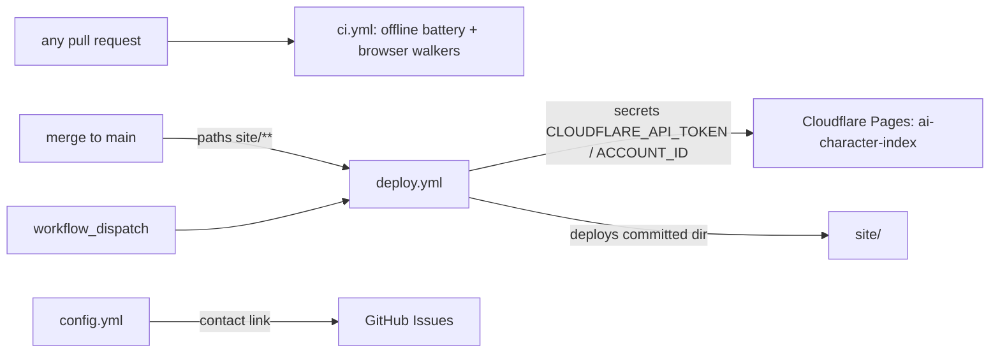

# .github — PR-time verification + production deploy workflows

> Current-state doc: describes what exists now, not what should exist. Brought current with the Phase-2 stack (#28–#49) and the CI landing.

## Purpose
`.github/` holds the repo's CI/CD automation — PR-time verification (`ci.yml`) and a Cloudflare Pages deploy fired by merges to `main` (`deploy.yml`). The public inbound channel is the contact link on the repo's Issues page (`ISSUE_TEMPLATE/config.yml` enables blank issues and the mailto link).

## Contents
| Path | What it is |
|---|---|
| `workflows/ci.yml` | PR-time verification: offline battery (panel/provenance/cite/registry suites, data gate, byte-identity rebuilds, publish checks, app.js harnesses) + the three Playwright walkers against an installed Chrome. No secrets, `contents: read` only |
| `workflows/deploy.yml` | Deploys committed `site/` to Cloudflare Pages project `ai-character-index` on pushes to `main` filtered to `site/**`, plus `workflow_dispatch` |
| `workflows/README.md` | Operator docs: `ci.yml` jobs; deploy secrets setup; `notion-sync.yml` / `spec-watch.yml` still to come |
| `ISSUE_TEMPLATE/config.yml` | Blank issues enabled; mailto contact link (andrescotton@gmail.com) |

## Relationships
- `ci.yml` triggers on every `pull_request` and on `push` to `main`, deliberately without a paths filter (a filtered required check would skip PRs outside its paths and block merging). Two jobs: `offline` (stdlib python + node, nothing installed) and `browser` (pnpm deps + `browser-actions/setup-chrome`, then the three walkers).
- `deploy.yml` triggers: `push` to `main` (paths: `site/**`, `.github/workflows/deploy.yml`) and manual `workflow_dispatch`. Concurrency group `deploy-production` with `cancel-in-progress: false`; `permissions: contents: read`; job environment `production`. Steps: checkout → `pnpm/action-setup@v4` → `actions/setup-node@v4` (Node 22, pnpm cache) → `cloudflare/wrangler-action@v3` (wrangler pinned 4.110.0) running `pages deploy site --project-name ai-character-index --branch main`. Secrets consumed: `CLOUDFLARE_API_TOKEN`, `CLOUDFLARE_ACCOUNT_ID`.
- The deploy has no build step: `site/` is committed static output, and the paths filter watches `site/**` only, so `data/**` or `engine/**` changes trigger nothing until they are baked into `site/`.
- Its local twin is `pnpm deploy:site` from root `package.json`, documented in `workflows/README.md` as the interactive-`wrangler login` route to the same project.
- Inbound corrections/questions go through the contact link named in `README.md`'s "Contributing" section; GitHub surfaces it through the Issues form picker via `config.yml`.

## Dependency map

## As-is observations
- PLAN.md §5 promises four workflows (`ci.yml`, `deploy.yml`, `notion-sync.yml`, `spec-watch.yml`); `ci.yml` and `deploy.yml` exist, `notion-sync.yml` and `spec-watch.yml` do not.
- `engine/notion-sync/` contains only `.gitkeep`: the Notion sync engine promised by PLAN.md §1.2/§6 Phase 3 has no code.
- `engine/spec-watch/pull-latest.sh` exists and is used, but manually — sweep records log it being run (`research/sweeps/*/4-spec-coverage.md`), and `docs/onboarding-spec-coverage.md` lists it as the "Mirror refresher". No workflow invokes it.
- `data/schema/` holds a JSON Schema per canonical `data/*.json` file (plus the coverage sidecar schema), enforced by `engine/validate_data.py` — locally and in CI (`ci.yml`'s offline job runs the gate), meeting the PLAN.md §2/§5 promise to validate `data/*.json` against schemas on each PR.
- There is no per-PR preview deploy; production deploys fire only post-merge.
