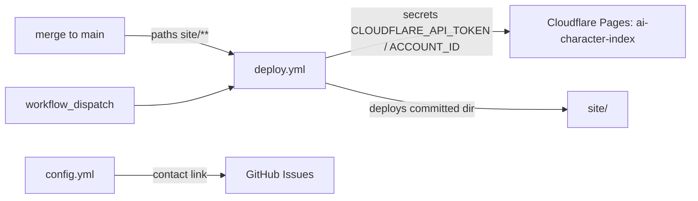

# .github — one production deploy workflow

> Current-state doc: describes what exists now, not what should exist. Brought current with the Phase-2 stack (#28–#41).

## Purpose
`.github/` holds the repo's only CI/CD automation — a Cloudflare Pages deploy fired by merges to `main`. The public inbound channel is the contact link on the repo's Issues page (`ISSUE_TEMPLATE/config.yml` enables blank issues and the mailto link).

## Contents
| Path | What it is |
|---|---|
| `workflows/deploy.yml` | The only workflow. Deploys committed `site/` to Cloudflare Pages project `ai-character-index` on pushes to `main` filtered to `site/**`, plus `workflow_dispatch` |
| `workflows/README.md` | Operator docs: required secrets setup; states `ci.yml` / `notion-sync.yml` / `spec-watch.yml` are "still to come" |
| `ISSUE_TEMPLATE/config.yml` | Blank issues enabled; mailto contact link (andrescotton@gmail.com) |

## Relationships
- `deploy.yml` triggers: `push` to `main` (paths: `site/**`, `.github/workflows/deploy.yml`) and manual `workflow_dispatch`. Concurrency group `deploy-production` with `cancel-in-progress: false`; `permissions: contents: read`; job environment `production`. Steps: checkout → `pnpm/action-setup@v4` → `actions/setup-node@v4` (Node 22, pnpm cache) → `cloudflare/wrangler-action@v3` (wrangler pinned 4.110.0) running `pages deploy site --project-name ai-character-index --branch main`. Secrets consumed: `CLOUDFLARE_API_TOKEN`, `CLOUDFLARE_ACCOUNT_ID`.
- The deploy has no build step: `site/` is committed static output, and the paths filter watches `site/**` only, so `data/**` or `engine/**` changes trigger nothing until they are baked into `site/`.
- Its local twin is `pnpm deploy:site` from root `package.json`, documented in `workflows/README.md` as the interactive-`wrangler login` route to the same project.
- Inbound corrections/questions go through the contact link named in `README.md`'s "Contributing" section; GitHub surfaces it through the Issues form picker via `config.yml`.

## Dependency map

## As-is observations
- PLAN.md §5 promises four workflows (`ci.yml`, `deploy.yml`, `notion-sync.yml`, `spec-watch.yml`); only `deploy.yml` exists on main (`git ls-tree origin/main .github/workflows/` shows just `deploy.yml` + `README.md`). `workflows/README.md` itself says the other three are "still to come".
- A `ci.yml` exists only on `ci/fast-suite` ("ci: run the fast suite on every PR") — a local-only branch that was never pushed (see `experiments-branches.md`); it is not an ancestor of `origin/main`.
- `engine/notion-sync/` contains only `.gitkeep`: the Notion sync engine promised by PLAN.md §1.2/§6 Phase 3 has no code.
- `engine/spec-watch/pull-latest.sh` exists and is used, but manually — sweep records log it being run (`research/sweeps/*/4-spec-coverage.md`, `behaviours-for-adria/*/4-spec-coverage.md`), and `docs/onboarding-spec-coverage.md` lists it as the "Mirror refresher". No workflow invokes it.
- `data/schema/` now holds a JSON Schema per canonical `data/*.json` file (plus the coverage sidecar schema), enforced locally by `engine/validate_data.py`; what is still missing is the `ci.yml` to run that gate, so the PLAN.md §2/§5 promise to "validate `data/*.json` against schemas in `data/schema/`" on each PR remains unmet on main.
- With no `ci.yml` on main there is no PR-time validation and no per-PR preview deploy; production deploys fire only post-merge.
