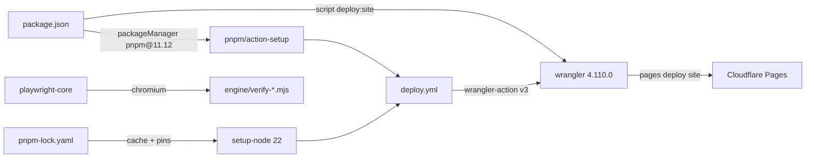

# Repo root — plan + front-door README, and a root-only pnpm setup for deploying site/

> Current-state doc: describes what exists now, not what should exist. Brought current with the Phase-2 stack (#28–#34).

## Purpose
The root holds the project's two entry documents (`PLAN.md`, `README.md`) and a minimal pnpm setup whose only functional role is to supply `wrangler` for deploying `site/` to Cloudflare Pages (plus `playwright-core` for the engine's reader checks).

## Contents
| File | Role |
|---|---|
| `PLAN.md` | Build plan & system design (written 2026-07-10): three-layer architecture, data model, page map, CI/CD table (§5), build phases (§6), repo map (§8). The source of the "what should exist" claims cross-checked in this doc set |
| `README.md` | Front door: positioning paragraph, short how-it-works, repo-map table, Contributing points to the Issues-page contact link |
| `package.json` | Root package `ai-character-index` (private); `packageManager: pnpm@11.12.0`; `engines.node >= 22`; one script, `deploy:site` = `wrangler pages deploy site --project-name ai-character-index`; devDeps: `wrangler ^4.110.0`, `playwright-core ^1.61.1` |
| `pnpm-workspace.yaml` | Declares no packages; only `allowBuilds` (esbuild, sharp, workerd) — the pnpm ≥10 allowlist letting wrangler's transitive deps run postinstall builds |
| `pnpm-lock.yaml` | Lockfile v9; exactly one importer (`.` = root); pins wrangler 4.110.0 and playwright-core 1.61.1 |
| `.gitignore` | Standard entries (node_modules, dist, .env, logs, .DS_Store), `.claude/` local settings, local panel run outputs (timestamped payloads + `manifest.json`; runlogs/metrics via `engine/panel/.gitignore`), user-registered specs (`specs/user/`), builder smoke scratch, plus two repo-specific private paths: `research/sources/Founding an AI Charter organisation.pdf` and `outreach/` |

## Relationships
- `deploy:site` and `.github/workflows/deploy.yml` are two routes to the same Cloudflare Pages project `ai-character-index`: the script uses interactive `wrangler login` and no `--branch` flag; CI uses repo secrets and `--branch main`, with wrangler pinned to the same 4.110.0 via `cloudflare/wrangler-action@v3`. `.github/workflows/README.md` documents both.
- In `deploy.yml`, `pnpm/action-setup@v4` reads `packageManager` from `package.json`, and `actions/setup-node` caches against `pnpm-lock.yaml` (workflow comment: pnpm 11.12 needs Node ≥ 22.13, hence `node-version: 22`).
- `playwright-core` is consumed only by `engine/verify-spec-reader.mjs` and `engine/verify-reader-test.mjs` (both `import { chromium } from "playwright-core"`); no `.github/` workflow runs them.
- `README.md`'s repo-map links resolve in the post-merge tree (`SYSTEM.md` and `docs/OVERVIEW.md` are added by this documentation set; `outreach/` is gitignored and unlinked): `research/` (+ `core-behaviour-list.md`, `sweeps/`), `.claude/skills/` (+ its README), `specs/`, `methodology/`, `behaviours-for-adria/`, `data/` (+ `data/README.md`), `engine/` (+ `engine/README.md`), `site/`, `docs/` (+ `docs/OVERVIEW.md`), `design/`, `vision/` (+ `features to build.md`); the README points onward to `SYSTEM.md` for the system map and frames `PLAN.md` as the original design.

## Dependency map

## As-is observations
- The "pnpm workspace" is the root package alone: `pnpm-workspace.yaml` has no `packages:` key and `pnpm-lock.yaml` has a single importer. All three `allowBuilds` entries correspond to wrangler transitive deps actually present in the lockfile.
- PLAN.md §8's repo map lists `outreach/` as a repo folder, but `.gitignore` excludes `outreach/` — it can only exist in local clones, never on main.
- PLAN.md §5's CI/CD table promises `ci.yml`, `notion-sync.yml`, `spec-watch.yml` alongside `deploy.yml`; `ci.yml` and `deploy.yml` exist, the other two do not (see `.github/OVERVIEW.md`).
- `deploy:site` is referenced in `.github/workflows/README.md` and in two skill files (`.claude/skills/OVERVIEW.md`, `sweep-verify/SKILL.md`); nothing in `.github/` invokes it — CI calls the wrangler action directly.
- `engines`/`scripts` nothing calls: none — both devDeps have consumers (`deploy.yml`/`deploy:site` use wrangler; the two `engine/verify-*.mjs` use playwright-core), though the playwright consumers run manually only.
- Node version tension: `package.json` declares `engines.node >=22`, but the workflow comment quoted above says pnpm 11.12 needs Node ≥ 22.13 — Node 22.0–22.12 satisfies `engines` yet not the pinned packageManager. `deploy.yml`'s `node-version: 22` resolves to the latest 22.x, which clears 22.13; the `engines` floor is simply looser than reality.
