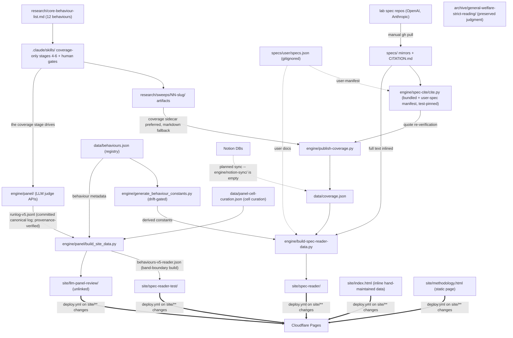

# SYSTEM — global map of the AI Character Index repository

> Current-state doc, plus the branch/local territory documented in `experiments-branches.md`. Describes what exists now, not what should exist. Each directory has its own `OVERVIEW.md`; this file stitches them together. Brought current with the Phase-2 stack (#28–#41).

> **Scope (repo-owner decision):** the deliverable is the **model spec reader only** — behaviour × spec coverage with cited passages. The eval-discovery/quality workflow (sweep stages 1–3, `evals.json`, `sources/`, evidence-strength lens) is outside the deliverable and was deleted by the scope ruling (2026-08-19). This document maps the whole repo as-is; in/out rulings and removal tasks are tracked in [CLOSEOUT-LIST.md](CLOSEOUT-LIST.md).

## What the system is

An index of AI character: **behaviours** (a canonical list) × **model-spec coverage** (cited verdicts against lab specs), published as a static site. Editing intent lives in sweep artifacts; git is the canonical gate (a merged PR is the push-to-production act); the site is committed static output deployed to Cloudflare Pages. An LLM-panel pipeline and a coverage-only, human-gated sweep procedure do the actual knowledge production. Behaviour identity is registry-driven (`data/behaviours.json`); users can register their own specs and behaviours locally (the clone/fork pathway — `specs/user/specs.json` + `set:user` registry entries, nothing pushed back).

## Global dependency map

## Component catalogue

| Directory | One-line role | Detail |
|---|---|---|
| `.claude/skills/` | LLM-facing procedure layer: coverage-only stages 4–6 with human gates (agent-neutral markdown; root `AGENTS.md` points here) | [.claude/skills/OVERVIEW.md](.claude/skills/OVERVIEW.md) |
| `engine/` | Automation: citation resolution, LLM panel judging, payload builders, E2E + feature-harness verifiers | [engine/OVERVIEW.md](engine/OVERVIEW.md) |
| `data/` | Canonical machine-readable data: behaviour registry, coverage ledgers, labs, schema/ | [data/OVERVIEW.md](data/OVERVIEW.md) |
| `specs/` | Version-pinned lab-spec mirrors + locator grammar | [specs/OVERVIEW.md](specs/OVERVIEW.md) |
| `research/` | Canonical behaviour list + per-behaviour sweep records | [research/OVERVIEW.md](research/OVERVIEW.md) |
| `archive/` | Preserved analytical artifact: the cross-spec strict-reading judgment (self-describing README inside) | — |
| `methodology/` | Depth rubric, public site copy, method-exploration findings | [methodology/OVERVIEW.md](methodology/OVERVIEW.md) |
| `site/` | Five static surfaces, no build step | [site/OVERVIEW.md](site/OVERVIEW.md) |
| `.github/` | One deploy workflow + Issues-page contact link | [.github/OVERVIEW.md](.github/OVERVIEW.md) |
| `docs/` | One onboarding document bridging both repo eras | [docs/OVERVIEW.md](docs/OVERVIEW.md) |
| `design/`, `vision/` | Settled-design log (Jul 2026) and the originating brief | [design/OVERVIEW.md](design/OVERVIEW.md), [vision/OVERVIEW.md](vision/OVERVIEW.md) |
| root files | PLAN.md, README.md, pnpm-for-wrangler setup | [ROOT.md](ROOT.md) |
| branch/local territory | Experiment branches, parked CI work, local-only branches | [experiments-branches.md](experiments-branches.md) |

## System-level contracts (the tissue between components)

1. **Locator grammar** — `specs/CITATION.md` defines the format; `cite.py` implements it (bundled specs + optional user manifest); every stored citation in `data/` and site payloads depends on byte-exact resolution. CI re-resolves on every PR (the `tests/` suite re-resolves every published locator through `cite.py`); `publish-coverage.py` runs enforce it at publish time.
2. **Coverage artifact format** — prescribed by `.claude/skills/sweep-coverage`: the structured `spec-coverage.json` sidecar (schema-checked) is preferred, with `engine/publish-coverage.py` falling back to regex-scraping the markdown. (Sweeps predating the rename keep the legacy `4-spec-coverage.*` filenames; the publisher resolves both.) The artifact is simultaneously prose record, parser input, and gate evidence.
3. **Behaviour identity** — registry-driven since #28: `data/behaviours.json` is the source of truth; `engine/generate_behaviour_constants.py` regenerates the derived constants (`spec-reader/app.js GROUPS`, `build-spec-reader-data.py BEHAVIOURS`, the judge-prompt titles in `engine/panel/behaviours.json` -- keys are registry slugs, the same slugs the panel runlogs are keyed by), with `tests/test_behaviour_registry.py` as the drift gate. `behaviour_id` remains **file-local across disjoint numbering spaces** (id 1 = "No sycophancy" in `coverage.json`, "Helpfulness" in `reader-test-coverage.json`); the registry namespaces ids per set and slugs are the global key.
4. **Runlog convention** — JSONL rows keyed by rubric version; the harness and both executors share one default, the gitignored `runlog-user.jsonl`, so a plain run never writes a committed log. The canonical shipped runlog is committed (`engine/panel/runlog-v5.jsonl`, the v5 full bench on the 9-point scale, documented in `runlog-v5.md`; the v3-era `runlog-v3.jsonl` stays committed with its record) and `engine/panel/verify_panel_provenance.py` proves the shipped payload rebuilds from it byte-identically; other runlogs stay gitignored. `whole_doc.py` stamps v5 by default since the prompt port (`engine/panel/prompts/v5.txt`, byte-identical to the calibration source); v3-family reruns sit behind `--rubric=v3w`/`v3s`.
5. **Site payloads** — `spec-reader/data/documents.json` is shared by all three reader surfaces; panel citations carry `exampleBlock` flags anchoring example blocks. Panel runs emit timestamped payloads + `manifest.json` (latest-by-default, gitignored); the committed `behaviours.json` is the fresh-clone fallback. The compare view generalizes to N documents — every document renders as a pane with a boundary resizer between adjacent panes (a user-registered spec is a first-class pane).
6. **Deploy trigger** — pushes to main filtered to `site/**` and `.github/workflows/deploy.yml` (plus manual dispatch): data/engine changes are invisible to production until baked into committed payloads.

## Cross-cutting as-is risks (synthesized from all overviews)

1. **CI runs on every PR** (`.github/workflows/ci.yml`): the offline battery (panel/provenance/cite/registry suites, data gate, builder byte-identity, publish checks, app.js harnesses) plus the three Playwright walkers against an installed Chrome. The pre-commit gate from the parked `hooks/fast-gate` branch remains unlanded.
2. **`cite.py` is the foundation** of every chain; docs call it the trickiest code in the repo. Its bundled + user-manifest contracts are now pinned by tests and corpus goldens.
3. **Behaviour metadata is registry-driven** (`data/behaviours.json` → derived constants, drift-gated): `engine/generate_behaviour_constants.py` regenerates the reader builder's `BEHAVIOURS` list too, which currently enumerates ids 1–3 because those are the covered behaviours — expected sequencing, not hardcoding. Residual fragmentation: the disjoint per-file id spaces persist (documented in the registry's per-set semantics).
4. **Documentation describes a system that half-exists**: PLAN.md promises Notion sync, four workflows, Astro, schemas; reality has one workflow, vanilla JS, and an empty `notion-sync/` — and this doc set now records the gap file-by-file.
5. **Hand-maintained surfaces**: `index.html` inline data (diverged from its prototype source). The reader-test bench payload is a derived build (`build_site_data.py --threshold=4 --solid-threshold=6` on the committed v5 run); its cell curation lives in `data/panel-cell-curation.json`.
6. **Provenance is now committed and verified**: behaviour 1 publishes from a reconstructed sidecar; the shipped panel runlog is committed and byte-identity-verified. Residual: the substitution note in the payload is still a hand-edited string, and single-judge runs degenerate the tier cutoffs (display model assumes ≥2 judges).
7. **No Python packaging**: importlib/sys.path wiring persists (config is now lazy/injectable; dead code and the stale config comment are removed).
8. **Orphans and residue**: `llm-panel-review/` unlinked from all navs; `spec-watch` no longer fetches the dated release archives (nothing consumes them; they exceeded the contents API's inline limit) and aborts loud when upstream versions diverge from cite.py's registry; sweep records referencing the rubric at a stale path (annotated with its current `methodology/` location). Root agent-context now exists (`AGENTS.md`, added with the stack-reconciliation docs) pointing at the agent-neutral procedures under `.claude/skills/`.

## Reading order for a cold-start agent

`README.md` → this file → `docs/onboarding-spec-coverage.md` (coverage track) or `engine/panel/README.md` (panel track) → the `OVERVIEW.md` of the directory being touched → `.claude/skills/README.md` before running any sweep.
