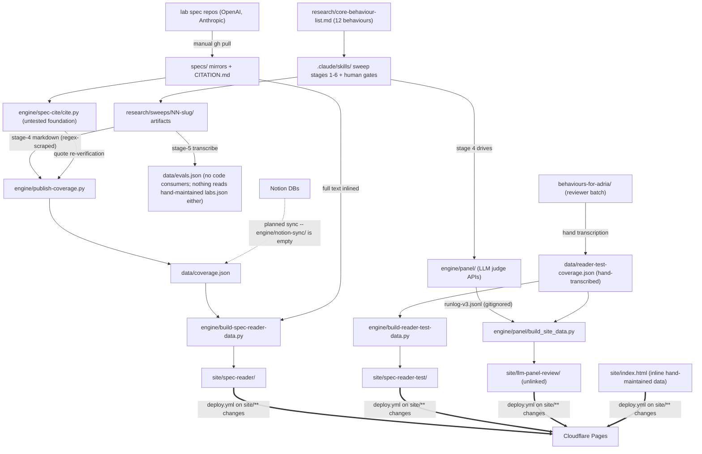

# SYSTEM — global map of the AI Character Index repository

> As-is snapshot of origin/main @ 31fddca (2026-08-17), plus the branch/local territory documented in `experiments-branches.md`. Describes what exists now, not what should exist. Each directory has its own `OVERVIEW.md`; this file stitches them together.

> **Scope (repo-owner decision):** the deliverable is the **model spec reader only** — behaviour × spec coverage with cited passages. The eval-discovery/quality workflow (sweep stages 1–3, `evals.json`, `sources/`, evidence-strength lens) is outside the deliverable. This document maps the whole repo as-is; in/out rulings and removal tasks are tracked in [PREPUBLICATION-PUNCHLIST.md](PREPUBLICATION-PUNCHLIST.md).

## What the system is

An evidence-based index of AI character: **behaviours** (a canonical list) × **model-spec coverage** (cited verdicts against lab specs) × **evaluation evidence** (curated public evals), published as a static site. Editing intent lives in Notion and sweep artifacts; git is the canonical gate (a merged PR is the push-to-production act); the site is committed static output deployed to Cloudflare Pages. An LLM-panel pipeline and a staged, human-gated "behaviour sweep" procedure do the actual knowledge production.

## Global dependency map

## Component catalogue

| Directory | One-line role | Detail |
|---|---|---|
| `.claude/skills/` | LLM-facing procedure layer: staged sweeps with 6 human gates | [.claude/skills/OVERVIEW.md](.claude/skills/OVERVIEW.md) |
| `engine/` | Automation: citation resolution, LLM panel judging, payload builders, E2E verifiers | [engine/OVERVIEW.md](engine/OVERVIEW.md) |
| `data/` | Canonical machine-readable data (4 JSON files, empty schema/) | [data/OVERVIEW.md](data/OVERVIEW.md) |
| `specs/` | Version-pinned lab-spec mirrors + locator grammar | [specs/OVERVIEW.md](specs/OVERVIEW.md) |
| `research/` | Canonical behaviour list + per-behaviour sweep records | [research/OVERVIEW.md](research/OVERVIEW.md) |
| `behaviours-for-adria/` | Independent reviewer-batch stage-4 set (test bench, plus 3 rows feeding the panel surface) | [behaviours-for-adria/OVERVIEW.md](behaviours-for-adria/OVERVIEW.md) |
| `methodology/` | Depth rubric, public site copy, method-exploration findings | [methodology/OVERVIEW.md](methodology/OVERVIEW.md) |
| `site/` | Five static surfaces, no build step | [site/OVERVIEW.md](site/OVERVIEW.md) |
| `.github/` | One deploy workflow + two public intake forms | [.github/OVERVIEW.md](.github/OVERVIEW.md) |
| `docs/` | One onboarding document bridging both repo eras | [docs/OVERVIEW.md](docs/OVERVIEW.md) |
| `design/`, `vision/` | Settled-design log (Jul 2026) and the originating brief | [design/OVERVIEW.md](design/OVERVIEW.md), [vision/OVERVIEW.md](vision/OVERVIEW.md) |
| root files | PLAN.md, README.md, pnpm-for-wrangler setup | [ROOT.md](ROOT.md) |
| branch/local territory | Experiment branches, parked CI work, local-only branches | [experiments-branches.md](experiments-branches.md) |

## System-level contracts (the tissue between components)

1. **Locator grammar** — `specs/CITATION.md` defines the format; `cite.py` implements it; every stored citation in `data/` and site payloads depends on byte-exact resolution. No CI re-resolves; only `publish-coverage.py` runs enforce it.
2. **Stage-4 markdown format** — prescribed by `.claude/skills/4-sweep-spec-coverage`, regex-scraped by `engine/publish-coverage.py`. The artifact is simultaneously prose record, parser input, and gate evidence.
3. **Behaviour identity** — at least six hand-synced copies: `core-behaviour-list.md` (12), `site/spec-reader/app.js GROUPS` (13), `engine/build-spec-reader-data.py BEHAVIOURS` (3), `engine/panel/behaviours.json`, `panel-config.json`, `.github/ISSUE_TEMPLATE/submit-eval.yml`. Worse, `behaviour_id` is **reused across disjoint numbering spaces**: id 1 = "No sycophancy" in `coverage.json` but "Helpfulness" in `reader-test-coverage.json`.
4. **Runlog convention** — JSONL rows keyed by rubric version; defaults disagree between `harness.RUNLOG` and the executors; the canonical shipped runlog lives on the unmerged `experiment/panel-judges` branch.
5. **Site payloads** — `spec-reader/data/documents.json` is shared by all three reader surfaces; panel citations carry `exampleBlock` flags anchoring example blocks.
6. **Deploy trigger** — pushes to main filtered to `site/**` and `.github/workflows/deploy.yml` (plus manual dispatch): data/engine changes are invisible to production until baked into committed payloads.

## Cross-cutting as-is risks (synthesized from all overviews)

1. **Nothing is verified automatically.** No CI runs tests, schema validation, or locator re-resolution; `data/schema/` is empty. A draft `ci.yml` + test suite + pre-commit gate exist only on parked local branches (`ci/fast-suite`, `tests/cite-suite`, `hooks/fast-gate`).
2. **`cite.py` is the untested foundation** of every chain; docs call it the trickiest code in the repo.
3. **Behaviour metadata fragmentation** — six hand-synced copies plus the disjoint-id collision above; one list change is a multi-file surgery with no error signal.
4. **Documentation describes a system that half-exists**: PLAN.md/README promise Notion sync, four workflows, Astro, schemas; reality has one workflow, vanilla JS, and an empty `notion-sync/`.
5. **Hand-maintained surfaces**: `index.html` inline data (diverged from its prototype source) and hand-transcribed `reader-test-coverage.json`.
6. **Provenance fragility**: behaviour 1's published records are currently unregenerable (missing sweep artifact); shipped panel data's runlog lives on an unmerged branch.
7. **No Python packaging**: importlib/sys.path wiring, config read at import time, dead code and stale config in the panel modules.
8. **Orphans and residue**: `llm-panel-review/` unlinked from all navs; 0-byte spec archives; `labs.json`/`evals.json` read by nothing; sweep records referencing the rubric at a stale path (annotated with its current `methodology/` location); no root agent-context files (AGENTS.md/QWEN.md/CLAUDE.md) — the procedures are reachable only through the Claude-specific `.claude/skills/` path.

## Reading order for a cold-start agent

`README.md` → this file → `docs/onboarding-spec-coverage.md` (coverage track) or `engine/panel/README.md` (panel track) → the `OVERVIEW.md` of the directory being touched → `.claude/skills/README.md` before running any sweep.
