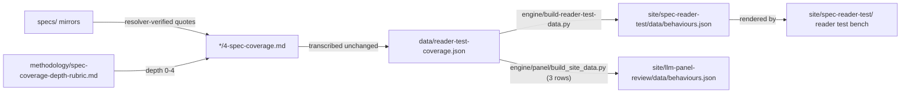

# behaviours-for-adria/ — an external reviewer's ten-behaviour set, swept for spec coverage; published to the reader test bench, with three rows also feeding the panel-review surface

> As-is snapshot of origin/main @ 31fddca (2026-08-17). Describes what exists now, not what should exist.

## Purpose
Holds stage-4 (spec-coverage) sweep artifacts for ten behaviours supplied by an external reviewer ("Adria"). It is a deliberate side channel so that set can be published, revised, and withdrawn without touching the index's own behaviour list, data, or published reader.

## Contents
| Path | Holds |
|---|---|
| `README.md` | Batch overview: provenance, coverage summary table (all ten covered, depths 3–4, 294 locators across 30 behaviour×spec views), the one-hop publish route, cross-behaviour notes |
| `01-helpfulness/` … `08-user-autonomy/` | Eight numbered folders, each with a single `4-spec-coverage.md`: term sweep, resolver-verified excerpt set, per-spec verdict + depth, "considered and not kept" log, mechanical re-check output, Gate-4 checklist |
| `general-guidelines/README.md` | The second group, defined by a *filter over the specs* rather than a construct; renders under its own bench heading with a broken margin rule |
| `general-guidelines/01-animal-welfare-impacts/` | "General welfare impacts" — 51 locators, covered/4 on both specs |
| `general-guidelines/02-general-welfare-impacts-strict/` | Strict reading of the same supplied definition (keeps a passage only where both specs state the same rule) — 38 locators, covered/4 on both specs; the two rows are kept side by side as an editorial decision |

## Relationships
These behaviours are NOT the numbered Tier-1 rows in `research/core-behaviour-list.md` (they were supplied by name + one-line definition, no pre-registered facets). They were produced with the `.claude/skills/4-sweep-spec-coverage` skill and cite `specs/` mirrors via `specs/CITATION.md` + `engine/spec-cite/cite.py`, depth-scored against `methodology/spec-coverage-depth-rubric.md`. Publish routes: `**/4-spec-coverage.md` → `data/reader-test-coverage.json` (the ledger) → `engine/build-reader-test-data.py` → `site/spec-reader-test/data/behaviours.json`; and — for three of the ten rows (`helpfulness`, `harm-avoidance-to-third-parties`, `avoiding-over-and-under-caution`, per `panel-config.json` `display.behaviours`) — the same ledger is read by `engine/panel/build_site_data.py`, which carries their curated verdict/depth/notes through untouched into `site/llm-panel-review/data/behaviours.json`. Nothing here reaches Notion, `data/coverage.json`, `research/core-behaviour-list.md`, or the published `site/spec-reader/`. Verification uses `engine/verify-reader-test.mjs`.

## Dependency map

## As-is observations
- The folder is named for the reviewer ("for-adria"), a person-specific label; the set is otherwise described generically as "an external reviewer's behaviour set".
- Every file is stopped at Gate 4 with the human spot-read/sign-off unchecked and awaiting Andrés (per `README.md` "Gate status"); publishing to the bench does not close that item.
- All ten verdicts are `covered` — there is no `partial` or `not-in-spec` case in the batch, so the bench exercises only one verdict branch.
- `data/reader-test-coverage.json` records the batch as its sole source (`generatedFrom` lists all ten `4-spec-coverage.md` paths); the ledger holds 10 behaviours and 20 coverage rows (10 × 2 labs).
- The eight numbered behaviours overlap by design (helpfulness/harm/caution/objectivity/autonomy family), so several spec passages are cited under different roles across files; the boundary is recorded per file in scope notes and "considered and not kept".
- Two sweep authors are recorded: the eight numbered rows by "Claude Code (Opus 4.8)" on 2026-07-24, and the two general-guidelines rows by "Claude Code (Opus 5)" on 2026-07-25.
