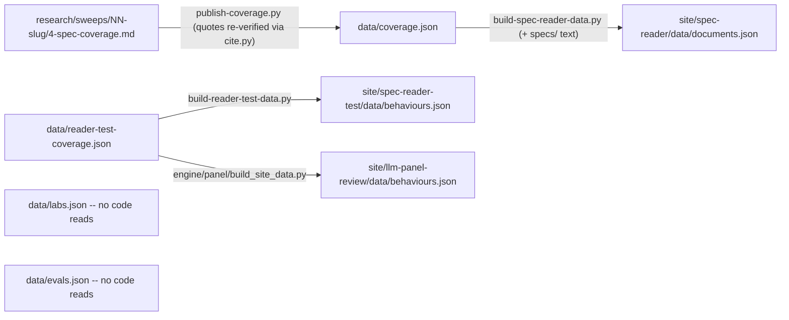

# data/ — canonical machine-readable data the site renders from
> As-is snapshot of origin/main @ 4fe2dac (2026-08-18); the documentation set itself is added by this PR. Describes what exists now, not what should exist.

## Purpose
Per `data/README.md`, this directory is "the canonical machine-readable data the site renders from," changed only via reviewed PRs. It currently holds cited spec-coverage verdicts, the lab list, and one eval survey. Derived views (evidence strength per cell, the gap list) are planned but computed nowhere today; when implemented they should be computed at render time, never stored here.

## Contents
| File | Top-level keys / one-line semantics | Size |
|---|---|---|
| `coverage.json` | `coverage`: 6 records = 3 index behaviours (no-sycophancy, calibration, action-honesty) × 2 labs; all verdicts `covered`; 88 citations. Record shape: `behaviour_id/name, lab_id, verdict, depth_0_4, depth_note, citations[] (locator, quote, role, adjacent?, example_block?), verified_against_version, verified_date, citation_format` | 562 lines / 48K |
| `labs.json` | `labs`: 2 entries (anthropic, openai): id, name, spec title/version/date/URL, `local_copy` path into `specs/`, has_published_spec | 24 lines |
| `evals.json` | `rubric_version, sweep_date, assessment (human_reviewed: false), evals (5), rejected (9)`; each eval carries sources with live-check status, 0-4 quality scores, per-lab adherence bands; all 5 evals are behaviour 1 (sycophancy) | 149 lines / 16K |
| `reader-test-coverage.json` | `note, generatedFrom (10 sweep paths), behaviours (10), coverage (20 records, same shape as coverage.json, 294 citations)`; an external reviewer's behaviour set for the reader test bench, explicitly not index verdicts | 2381 lines / 228K |
| `schema/` | only `.gitkeep` — no schemas present | — |
| `README.md` | intended file set incl. planned `behaviours.json`, `meta.json` (both absent) | 19 lines |

## Relationships
`engine/publish-coverage.py` writes `coverage.json`: it parses `research/sweeps/NN-<slug>/4-spec-coverage.md`, re-verifies every quote byte-for-byte via `engine/spec-cite/cite.py resolve` against `specs/`, then replaces that behaviour's records. `reader-test-coverage.json` has no writer script — it was hand-transcribed from `behaviours-for-adria/**/4-spec-coverage.md`. `labs.json` and `evals.json` are hand-maintained (`engine/notion-sync/` is empty, Phase 3 per PLAN.md). Consumers: `engine/build-spec-reader-data.py` reads `coverage.json` and inlines both spec texts into `site/spec-reader/data/documents.json` (fetched by `site/spec-reader/app.js`, and also by `site/spec-reader-test/app.js` and `site/llm-panel-review/app.js`). `engine/build-reader-test-data.py` and `engine/panel/build_site_data.py` read `reader-test-coverage.json` into `site/spec-reader-test/data/behaviours.json` and `site/llm-panel-review/data/behaviours.json`. `labs.json` and `evals.json` are read by no code. `engine/verify-spec-reader.mjs` / `verify-reader-test.mjs` check the built site payloads, not `data/` directly. No CI workflow touches this directory (`.github/workflows/` holds only `deploy.yml`).

## Dependency map

## As-is observations
- `data/schema/` is empty (`.gitkeep` only) and no CI validates data files; `.github/workflows/` contains only `deploy.yml` — the `ci.yml` PLAN.md §5 describes does not exist.
- The planned `behaviours.json` (single behaviour registry) and `meta.json` do not exist; `data/README.md` documents them as planned-but-absent.
- Behaviour IDs collide across files: `coverage.json` id 1 = "No sycophancy", `reader-test-coverage.json` id 1 = "Helpfulness"; the files share record shape but not behaviour sets.
- The published behaviour definitions (ids 1-3) exist only as a hardcoded `BEHAVIOURS` constant in `engine/build-spec-reader-data.py`.
- `labs.json` and `evals.json` have zero programmatic consumers; `site/index.html` is a static prototype that fetches no JSON.
- `reader-test-coverage.json` has two consumers: `engine/build-reader-test-data.py` (the whole set) and `engine/panel/build_site_data.py` (three rows carried into the panel surface).
- `evals.json` `assessment.human_reviewed` is false; all 5 evals map only to behaviour 1.
- `research/sweeps/01-no-sycophancy/` has no `4-spec-coverage.md` (only `1-dossiers.md`, `gates.md`, `register.md`), so behaviour 1's published records cannot currently be regenerated with `publish-coverage.py`; behaviours 2-3 have their artifacts.
- `coverage.json` `citation_format` claims quotes are exact `cite.py resolve` output; enforcement happens only when `publish-coverage.py` is run, not in CI.
