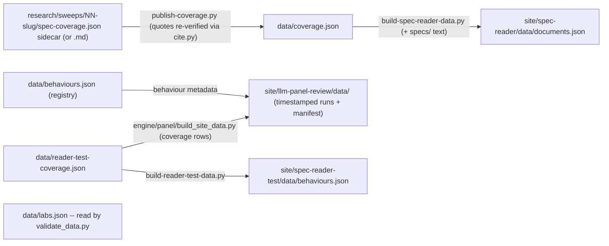

# data/ — canonical machine-readable data the site renders from
> Current-state doc: describes what exists now, not what should exist. Brought current with the Phase-2 stack (#28–#34).

## Purpose
Per `data/README.md`, this directory is "the canonical machine-readable data the site renders from," changed only via reviewed PRs. It currently holds cited spec-coverage verdicts, the behaviour registry, the lab list, and the reader-test bench ledger. Derived views (evidence strength per cell, the gap list) are planned but computed nowhere today; when implemented they should be computed at render time, never stored here.

## Contents
| File | Top-level keys / one-line semantics | Size |
|---|---|---|
| `behaviours.json` | The behaviour registry: one entry per behaviour in every set (`index`, `reader-test`, `user`), keyed by slug; per-set `numeric_id`, `name`, `group`, `definition`, `facets`. Source of truth for behaviour identity; derived constants regenerate via `engine/generate_behaviour_constants.py` | 186 lines |
| `coverage.json` | `coverage`: 6 records = 3 index behaviours (no-sycophancy, calibration, action-honesty) × 2 labs; all verdicts `covered`; 88 citations. Record shape: `behaviour_id/name, lab_id, verdict, depth_0_4, depth_note, citations[] (locator, quote, role, adjacent?, example_block?), verified_against_version, verified_date, citation_format` | 562 lines / 46K |
| `labs.json` | `labs`: 2 entries (anthropic, openai): id, name, spec title/version/date/URL, `local_copy` path into `specs/`, has_published_spec | 24 lines |
| `reader-test-coverage.json` | `note, generatedFrom (10 sweep paths), behaviours (10), coverage (20 records, same shape as coverage.json, 294 citations)`; an external reviewer's behaviour set for the reader test bench, explicitly not index verdicts | 2381 lines / 224K |
| `schema/` | JSON Schemas for `behaviours.json`, `coverage.json`, `labs.json`, `reader-test-coverage.json`, plus `spec-coverage-sidecar.schema.json` (the coverage sidecar; enforced by `engine/publish-coverage.py` at publish time, deliberately not in the gate's CHECKS) | — |
| `README.md` | current-files inventory with a writer column; `meta.json` noted as planned-but-absent | 20 lines |

## Relationships
`engine/publish-coverage.py` writes `coverage.json`: it parses a coverage artifact (the `spec-coverage.json` sidecar when present, else `research/sweeps/NN-<slug>/spec-coverage.md`; the committed sweeps keep the legacy `4-spec-coverage.*` names, which resolve too), re-verifies every quote byte-for-byte via `engine/spec-cite/cite.py resolve` against `specs/`, then replaces that behaviour's records. `reader-test-coverage.json` was transcribed from `behaviours-for-adria/**/4-spec-coverage.md` and is machine-checked against those artifacts by `engine/generate-reader-test-ledger.py` (`--check` runs in CI; its DISCLOSED list pins the one judgment divergence and the lightly edited roles by name). `behaviours.json` and `labs.json` are hand-maintained (`engine/notion-sync/` is empty, Phase 3 per PLAN.md); `data/evals.json` was retired by the scope ruling (deleted 2026-08-19). Consumers: `engine/build-spec-reader-data.py` reads `coverage.json` and inlines both spec texts into `site/spec-reader/data/documents.json` (fetched by `site/spec-reader/app.js`, and also by `site/spec-reader-test/app.js` and `site/llm-panel-review/app.js`); with `--user-manifest=` it also folds user-registered specs in. `engine/build-reader-test-data.py` reads `reader-test-coverage.json` into `site/spec-reader-test/data/behaviours.json`. `engine/panel/build_site_data.py` reads `behaviours.json` for behaviour metadata and `reader-test-coverage.json` for the curated coverage rows, and writes timestamped payloads + `manifest.json` into `site/llm-panel-review/data/`. `labs.json` is read by `engine/validate_data.py` (cross-file `lab_id` rule), which gates every file here against `schema/` (+ `engine/test_validate_data.py` pins the gate). `engine/verify-spec-reader.mjs` / `verify-reader-test.mjs` check the built site payloads, not `data/` directly. No CI workflow touches this directory (`.github/workflows/` holds only `deploy.yml`).

## Dependency map

## As-is observations
- Schemas exist for every canonical file and `engine/validate_data.py` (+ its test suite) enforces them; no CI workflow runs the gate yet.
- `meta.json` (site-wide metadata) is still planned-but-absent; `behaviours.json` is the registry (see Contents).
- Behaviour IDs collide across files: `coverage.json` id 1 = "No sycophancy", `reader-test-coverage.json` id 1 = "Helpfulness"; the registry namespaces ids per set and documents the join semantics (ids are file-local, slugs are the global key).
- The reader's published behaviour definitions (ids 1-3) live as a generated `BEHAVIOURS` constant in `engine/build-spec-reader-data.py`, regenerated from `data/behaviours.json` by `engine/generate_behaviour_constants.py` (ids 1-3 because those are the covered behaviours); the panel's metadata is registry-driven too.
- `labs.json`'s only programmatic consumer is the validation gate; `site/index.html` is a static prototype that fetches no JSON.
- `reader-test-coverage.json` has two consumers: `engine/build-reader-test-data.py` (the whole set) and `engine/panel/build_site_data.py` (the curated rows behind the panel display list).
- `research/sweeps/01-no-sycophancy/` publishes from a reconstructed `4-spec-coverage.json` sidecar (built from the 20 published citations), so behaviour 1's records are regenerable via `publish-coverage.py`; behaviours 2-3 publish from their structured `4-spec-coverage.json` sidecars (sidecar preferred, markdown fallback).
- `coverage.json` `citation_format` claims quotes are exact `cite.py resolve` output; enforcement happens only when `publish-coverage.py` is run, not in CI.
