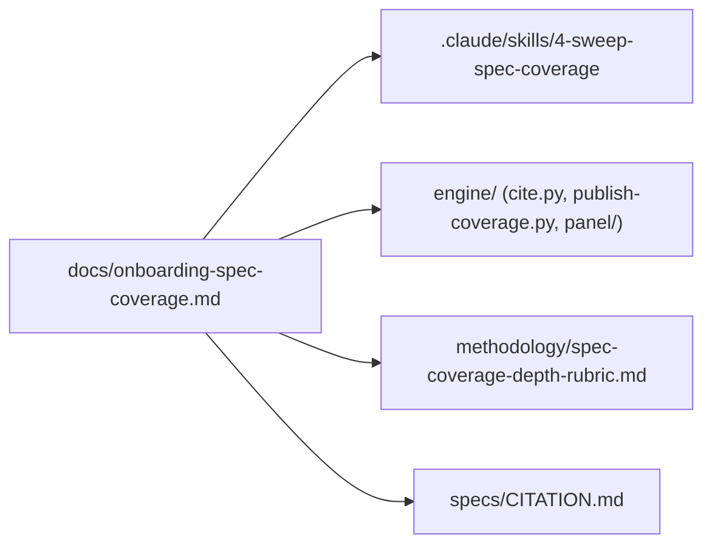

# docs/ — onboarding prose plus ruling-approved proposals

> Current-state doc: describes what exists now, not what should exist. Brought current with the Phase-2 stack (#28–#41).
>
> Header convention across these OVERVIEWs: a snapshot stamp ("as-is snapshot of origin/main @ <commit> (<date>)") means the doc was verified as of that commit; "brought current with the Phase-2 stack" means it has been reconciled with the stack.

## Purpose

Human/agent onboarding prose. The directory holds the spec-coverage track's onboarding doc — the only document that bridges the repo's original coverage pipeline and the later LLM-panel era — plus `proposals/`: two ruling-approved skill rescopes awaiting the skills-pass PR (tracked on the closeout list).

## Contents

| Path | What it is |
|---|---|
| `onboarding-spec-coverage.md` | The one true onboarding doc for the spec-coverage track: pipeline diagram, data contracts, conventions, and a reading order for a cold-start agent or mentee. Calls `cite.py` the trickiest code in the repo (now directly tested). |
| `proposals/` | Two ruling-approved coverage-only rescopes of `.claude/skills/5-sweep-publish/` and `6-sweep-verify/` under the model-spec-reader scope (repo-owner ruling 2026-08-18). Not live skills; the skills-pass PR moves them into `.claude/skills/` when it merges. |

Out of snapshot scope: `semantic-tagging-demo.md` exists only in local working copies, not on main (local-only territory belongs in `experiments-branches.md`).

## Relationships

- Documents the curated chain: `.claude/skills/4-sweep-spec-coverage` artifacts → `engine/publish-coverage.py` → `data/coverage.json` → `engine/build-spec-reader-data.py` → `site/spec-reader/`.
- Its §7 status list tracks the testing/CI hardening seams; most are now resolved (JSON schemas, direct `cite.py` tests, single behaviour-metadata source, the structured sidecar), with validation CI the remaining open item.

## Dependency map

## As-is observations

- §7's one remaining open item matches the current CI state: `deploy.yml` only, no validation CI, no locator re-resolution in CI; the `data/schema/` files and the `engine/validate_data.py` gate it once listed as missing now exist, and §7 itself carries the resolved/open statuses.
- §3 gives the behaviour list as 12 behaviours in 5 categories, matching `research/core-behaviour-list.md`; `methodology/mentee-project-archetypes.md` notes Notion has moved ahead of the repo file (13 rows there).
- One onboarding doc (plus the ruling-approved `proposals/` rescopes): nothing here covers the panel pipeline, the site surfaces, or repo-wide orientation — those live in per-component READMEs of uneven freshness.
