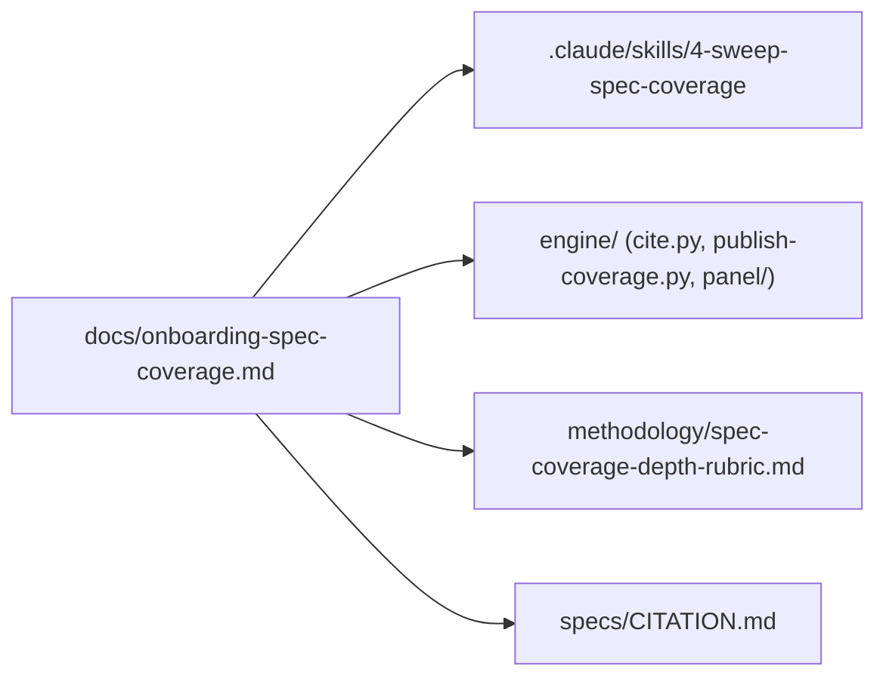

# docs/ — onboarding prose plus ruling-pending proposals

> As-is snapshot of origin/main @ 31fddca (2026-08-17). Describes what exists now, not what should exist.

## Purpose

Human/agent onboarding prose. On main this directory holds a single file — the spec-coverage track's onboarding doc — which is currently the only document that bridges the repo's original coverage pipeline and the later LLM-panel era. This PR adds `proposals/`: two draft skill rescopes awaiting a repo-owner ruling (tracked on the closeout list).

## Contents

| Path | What it is |
|---|---|
| `onboarding-spec-coverage.md` | The one true onboarding doc for the spec-coverage track: pipeline diagram, data contracts, conventions, and a reading order for a cold-start agent or mentee. Explicitly flags `cite.py` as untested ("the trickiest code in the repo"). |
| `proposals/` *(added by this PR)* | Two DRAFT proposals awaiting ruling — coverage-only rescopes of `.claude/skills/5-sweep-publish/` and `6-sweep-verify/` under the model-spec-reader scope. Not live skills; they stay out of `.claude/skills/` until approved. |

Files that exist only in local working copies, **not on main**: `semantic-tagging-demo.md`.

## Relationships

- Documents the curated chain: `.claude/skills/4-sweep-spec-coverage` artifacts → `engine/publish-coverage.py` → `data/coverage.json` → `engine/build-spec-reader-data.py` → `site/spec-reader/`.
- Its §7 "known gaps" list functions as the de-facto roadmap for testing/CI hardening (locator re-resolution in CI, JSON schemas, direct `cite.py` tests, single behaviour-metadata source).

## Dependency map

## As-is observations

- §7 accurately describes the current CI state: `deploy.yml` only, no validation CI, empty `data/schema/`, no locator re-resolution in CI.
- §3 gives the behaviour list as 12 behaviours in 5 categories, matching `research/core-behaviour-list.md`; `methodology/mentee-project-archetypes.md` notes Notion has moved ahead of the repo file (13 rows there).
- One onboarding doc (plus the ruling-pending `proposals/` drafts this PR adds): nothing here covers the panel pipeline, the site surfaces, or repo-wide orientation — those live in per-component READMEs of uneven freshness.
