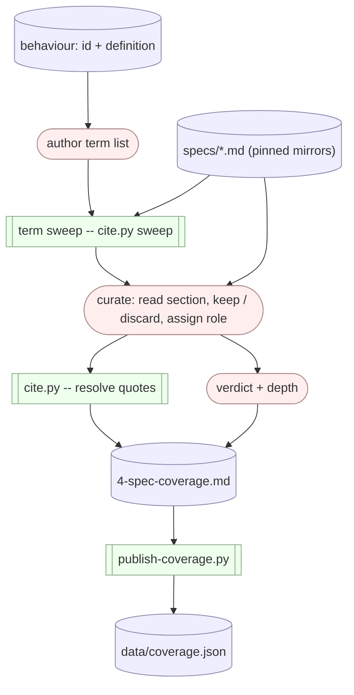

# Spec-coverage pipeline: determinism and test coverage

A reviewer's map of the spec-coverage discovery-to-scoring pipeline: which steps are
deterministic scripts, which are LLM judgement (and so vary run-to-run), and which have an
automated check today. It evolves commit by commit as tooling lands.

## Flow

- **Red -- LLM judgement:** non-deterministic run-to-run; guarded only by the human Gate 4 today.
- **Green -- deterministic script.**
- **Blue -- data / artifacts.**

## Per-step status (baseline)

| Step | Kind | Reproducible? | Automated check today |
|---|---|---|---|
| author term list | LLM judgement | no | none (human Gate 4) |
| term sweep (`cite.py sweep`) | deterministic script | yes (byte-for-byte) | reproduces the published table byte-for-byte; pinned by a test in `tests/test_cite.py` |
| curate: keep / discard / role | LLM judgement | no | none (human Gate 4) |
| verdict + depth | LLM judgement | no | none (human Gate 4) |
| cite.py -- resolve quotes | deterministic script | yes | quotes re-resolved byte-for-byte at publish; internals pinned by the golden + unit suite |
| publish-coverage.py | deterministic script | yes | re-verifies every stored quote |

**Takeaway:** the term sweep is now a deterministic script (`cite.py sweep`) reproducing the
published table byte-for-byte -- the mechanical half of discovery is reproducible. The
non-deterministic core is the remaining LLM judgement -- term authoring, curation, and scoring --
guarded today only by the human Gate 4, with no automated check. The deterministic scripts guard
quote fidelity.
