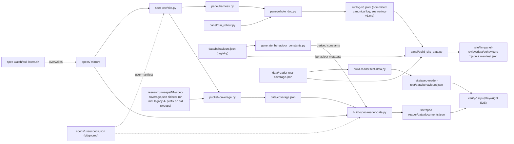

# engine/ — the automation layer: citation resolution, LLM panel judging, and site-payload builders

> Current-state doc: describes what exists now, not what should exist. Brought current with the Phase-2 stack (#28–#41).

## Purpose

Everything that keeps the index alive: resolves spec citations, runs LLM panel judging, transforms sweep artifacts and run logs into the JSON payloads the site renders, and verifies the rendered site end-to-end. No component here serves the public directly; outputs land in `data/`, `site/**/data/`, the `specs/` mirrors (spec-watch), and engine-local run artifacts (run logs, metrics, smoke samples, failure dumps).

## Contents

| Path | What it is |
|---|---|
| `spec-cite/cite.py` | Locator resolver/verifier (`outline`/`show`/`resolve`/`find`). Grammar defined by `specs/CITATION.md`; bundled specs (`BUNDLED_SPECS`) plus an optional user-spec manifest (`specs/user/specs.json`, gitignored; `SPEC_CITE_USER_SPECS` overrides) whose entries can carry `title`/`sourceUrl` rendering metadata (`spec_meta()`/`user_specs()`). Stdlib-only; CLI **and** imported library. Tests: `tests/test_cite.py`, `tests/test_cite_user_specs.py`. |
| `spec-watch/pull-latest.sh` | Pulls upstream OpenAI/Anthropic specs into `specs/` via `gh`. Manual today; no version pinning or diff detection. Known issue: the dated upstream HTML release archives exceed the contents API's 1 MB inline limit and are fetched as 0-byte files. |
| `panel/` | LLM panel pipeline: `harness.py` (library: lazy injectable config, frozen rubrics v1/v2/v3, explicit prompt composition, verdict parsing, resume), `whole_doc.py` (one API call per behaviour×spec×model), `run_rollout.py` (grid driver, dry-run default), `build_site_data.py` (runlog → site payload; behaviour metadata registry-driven from `data/behaviours.json`; parameterized via `--runlog=`/`--rubric=`/`--panel=`/`--behaviours=`/`--registry=`/`--run-date=`/`--out=` for iteration builds; with no `--out=`, a run writes timestamped `behaviours-<ts>.json` + `data/manifest.json`, latest-by-default), `select_strata.py` (validation sampler), `select_run.py` (pin → manifest-latest → shipped-fallback resolution, same order as the page), `verify_panel_provenance.py` (proves the shipped payload rebuilds byte-identically from the committed runlog), `test_panel.py` (92 offline tests), `test_verify_panel_provenance.py`, `panel-config.json`, `behaviours.json`, `runlog-v3.jsonl` (canonical runlog, documented in `runlog-v3.md`). |
| `publish-coverage.py` | Parses a coverage artifact — the structured `spec-coverage.json` sidecar when present (schema-checked), else the `spec-coverage.md` markdown via regexes; sweeps predating the rename keep the legacy `4-spec-coverage.*` names, which resolve too — and publishes records into `data/coverage.json`, re-verifying every quote through `cite.py resolve` (subprocess). Sidecar contract pinned by `tests/test_sidecar.py`. |
| `generate_behaviour_constants.py` | Regenerates the derived behaviour constants from `data/behaviours.json` (the registry): `GROUPS` in `site/spec-reader/app.js`, `BEHAVIOURS` in `build-spec-reader-data.py`, and the panel slug lists. `--check` exits 1 with a diff on drift; `tests/test_behaviour_registry.py` is the drift gate. |
| `build-spec-reader-data.py` | `data/coverage.json` + spec markdown → `site/spec-reader/data/documents.json`. Index behaviour list (`BEHAVIOURS`) generated from `data/behaviours.json` by `generate_behaviour_constants.py` (currently ids 1–3, the covered behaviours); `--user-manifest=PATH` folds user-registered specs in as extra documents (byte-identical output with no manifest — pinned by test). |
| `build-reader-test-data.py` | `data/reader-test-coverage.json` → `site/spec-reader-test/data/behaviours.json`. Shares `coverage_payload()` with the script above via `engine/coverage_payload.py` (W5 de-duplication done). |
| `verify-spec-reader.mjs`, `verify-reader-test.mjs` | Playwright E2E checks (need Chrome): every published passage must anchor, no console errors. Hardcode site DOM selectors; duplicate a static-server harness between them. |
| `verify-panel-features.mjs`, `stage_user_demo.py` | Site feature harness (needs Chrome): drives the panel + reader against BOTH the bundled payload and a user-extended staging, pinning URL/DOM-state features (payload resolution, tier bands incl. the single-judge floor, N-document compare, export) and interactions (resizers, focus toggle, passage navigation, URL sync). `stage_user_demo.py` stages a clone/fork-style site into scratch (synthetic user spec + a `set:user` behaviour); the repo's own site data is restored exactly after. |
| `notion-sync/` | Empty placeholder (`.gitkeep`) — Phase 3 per PLAN.md; does not exist. |

## Relationships

- `cite.py` is the shared foundation: imported by `panel/harness.py` and invoked as a subprocess by `publish-coverage.py`.
- Behaviour identity is registry-driven: `data/behaviours.json` → `generate_behaviour_constants.py` → the derived constants (reader `GROUPS`, reader-builder `BEHAVIOURS`, panel slug lists); `tests/test_behaviour_registry.py` fails any drift.
- The panel chain: `run_rollout.py` drives `whole_doc.py` → `runlog-v3.jsonl` (the canonical log behind the shipped payload is committed here, documented in `runlog-v3.md`; other runlogs stay gitignored) → `build_site_data.py` → `site/llm-panel-review/data/`. The builder reads `data/behaviours.json` for behaviour metadata and `data/reader-test-coverage.json` for the curated coverage rows; with no `--out=` it writes a timestamped payload + `data/manifest.json` (latest-by-default, both gitignored).
- The curated chain: sweep coverage artifact (sidecar JSON preferred, markdown fallback) → `publish-coverage.py` → `data/coverage.json` → `build-spec-reader-data.py` → `site/spec-reader/data/documents.json` (user-registered specs fold in via `--user-manifest=`).
- `spec-watch` overwrites `specs/`, which `cite.py` and `build-spec-reader-data.py` consume (the test-bench builder reads only `data/reader-test-coverage.json`).

## Dependency map

## As-is observations

- No Python package structure: no `__init__.py`/`pyproject.toml`; all cross-module wiring is `importlib` file-loading and a `sys.path` hack. Renames/moves break only at runtime.
- `cite.py` is the foundation of every chain (flagged in `docs/onboarding-spec-coverage.md` as "the trickiest code in the repo"); its bundled + user-manifest contracts are pinned by `tests/test_cite.py` and `tests/test_cite_user_specs.py` (plus the corpus goldens in `tests/golden/`).
- Markdown-as-API (mitigated): `publish-coverage.py` regex-scrapes human-written coverage artifacts when no structured sidecar is present; the `spec-coverage.json` sidecar is the preferred, schema-checked contract.
- Behaviour identity is registry-driven (`data/behaviours.json` → `generate_behaviour_constants.py`, drift-gated); spec identity still lives in `cite.py`'s bundled registry + `specs/CITATION.md` examples.
- Config loads lazily at use time and is injectable (`harness.load_config()`); the import-side-effect probe in `test_panel.py` pins that no panel module reads files at import.
- Runlog defaults disagree: `harness.RUNLOG` = `runlog.jsonl`, executors default to `runlog-v3.jsonl`; resume silently reads the wrong file if the override is forgotten.
- Locator separators diverge by producer: panel chain emits `" > "`, curated chain `" › "`; cite.py tolerates both, consumers must know which producer they face.
- The former dead symbols (`harness.BATCH`, `user_msg()`, `panel-config.json batch_size`, `build_site_data.VERDICT_WORD`) have been removed by the dead-code cleanup; the stale "unused legacy" config comment was fixed (closeout W7) — `threshold`/`solid_threshold` are both live (`solid_threshold` bakes into the payload's `adjacent` flag; tier display is client-side).
- Rubric prompts compose explicitly from named slots (`harness.render_system_v3`), with frozen-prompt tests pinning byte-identity to the pre-refactor strings (replaced the former `str.replace`+`assert` coupling).
- Nothing runs in CI: no workflow executes `test_panel.py`, `publish-coverage.py --check`, locator re-resolution, or the verifiers.
- Hygiene: `__pycache__/` + `*.pyc` are now gitignored (the committed `.pyc` was removed); `wholedoc-FAILED-*.txt` outputs are still not gitignored.
