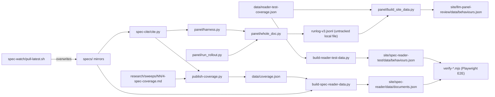

# engine/ — the automation layer: citation resolution, LLM panel judging, and site-payload builders

> As-is snapshot of origin/main @ 72e2e6b (2026-08-18); the documentation set itself is added by this PR. Describes what exists now, not what should exist.

## Purpose

Everything that keeps the index alive: resolves spec citations, runs LLM panel judging, transforms sweep artifacts and run logs into the JSON payloads the site renders, and verifies the rendered site end-to-end. No component here serves the public directly; outputs land in `data/`, `site/**/data/`, the `specs/` mirrors (spec-watch), and engine-local run artifacts (run logs, metrics, smoke samples, failure dumps).

## Contents

| Path | What it is |
|---|---|
| `spec-cite/cite.py` | Locator resolver/verifier (`outline`/`show`/`resolve`/`find`). Grammar defined by `specs/CITATION.md`; spec registry hardcoded (`SPECS` dict). Stdlib-only; CLI **and** imported library. No tests. |
| `spec-watch/pull-latest.sh` | Pulls upstream OpenAI/Anthropic specs into `specs/` via `gh`. Manual today; no version pinning or diff detection. Known issue: the dated upstream HTML release archives exceed the contents API's 1 MB inline limit and are fetched as 0-byte files. |
| `panel/` | LLM panel pipeline: `harness.py` (library: config, frozen rubrics v1/v2/v3, prompt builders, verdict parsing, resume), `whole_doc.py` (one API call per behaviour×spec×model), `run_rollout.py` (grid driver, dry-run default), `build_site_data.py` (runlog → site payload; parameterized via `--runlog=`/`--rubric=`/`--panel=`/`--behaviours=`/`--out=` for iteration builds), `select_strata.py` (validation sampler), `test_panel.py` (27 offline unit tests), `panel-config.json`, `behaviours.json`. |
| `publish-coverage.py` | Parses a stage-4 artifact (`research/sweeps/NN-slug/4-spec-coverage.md`) via regexes and publishes records into `data/coverage.json`, re-verifying every quote through `cite.py resolve` (subprocess). |
| `build-spec-reader-data.py` | `data/coverage.json` + spec markdown → `site/spec-reader/data/documents.json`. Hardcoded `BEHAVIOURS` list (ids 1–3 only). |
| `build-reader-test-data.py` | `data/reader-test-coverage.json` → `site/spec-reader-test/data/behaviours.json`. Contains a near-verbatim duplicate of `coverage_payload()` from the script above (identical modulo a `document_id`→`lab_id` parameter rename). |
| `verify-spec-reader.mjs`, `verify-reader-test.mjs` | Playwright E2E checks (need Chrome): every published passage must anchor, no console errors. Hardcode site DOM selectors; duplicate a static-server harness between them. |
| `notion-sync/` | Empty placeholder (`.gitkeep`) — Phase 3 per PLAN.md; does not exist. |

## Relationships

- `cite.py` is the shared foundation: imported by `panel/harness.py` (via a `sys.path` insertion) and invoked as a subprocess by `publish-coverage.py`.
- The panel chain: `run_rollout.py` drives `whole_doc.py` → `runlog-v3.jsonl` (the shipped runlog is an UNTRACKED FILE in a local working copy of `experiment/panel-judges`, committed to no branch; committing it is an open closeout item) → `build_site_data.py` → `site/llm-panel-review/data/behaviours.json`. The builder also reads `data/reader-test-coverage.json` for behaviour names/slugs.
- The curated chain: sweep stage-4 markdown → `publish-coverage.py` → `data/coverage.json` → `build-spec-reader-data.py` → `site/spec-reader/data/documents.json`.
- `spec-watch` overwrites `specs/`, which `cite.py` and `build-spec-reader-data.py` consume (the test-bench builder reads only `data/reader-test-coverage.json`).

## Dependency map

## As-is observations

- No Python package structure: no `__init__.py`/`pyproject.toml`; all cross-module wiring is `importlib` file-loading and a `sys.path` hack. Renames/moves break only at runtime.
- `cite.py` is the untested foundation of every chain (flagged in `docs/onboarding-spec-coverage.md` as "the trickiest code in the repo").
- Markdown-as-API: `publish-coverage.py` regex-scrapes human-written stage-4 artifacts; formatting drift breaks publication.
- Spec identity duplicated in 4+ places (`cite.py SPECS`, `build-spec-reader-data.py DOCUMENTS`, `data/labs.json`, `specs/CITATION.md` examples); behaviour metadata in six places.
- Four panel modules read `panel-config.json` at import time; config cannot be injected without monkeypatching.
- Runlog defaults disagree: `harness.RUNLOG` = `runlog.jsonl`, executors default to `runlog-v3.jsonl`; resume silently reads the wrong file if the override is forgotten.
- Locator separators diverge by producer: panel chain emits `" > "`, curated chain `" › "`; cite.py tolerates both, consumers must know which producer they face.
- The former dead symbols (`harness.BATCH`, `user_msg()`, `panel-config.json batch_size`, `build_site_data.VERDICT_WORD`) have been removed by the dead-code cleanup; `display.threshold`/`solid_threshold` are still marked "unused legacy" in the config comment but both are read by `build_site_data.py` (`solid_threshold` is baked into the payload; the stale comment is closeout item W7).
- Rubric-text coupling: `whole_doc.py` derives prompts by `str.replace` + `assert` on frozen strings in `harness.py` — rubric edits are two-file surgery.
- Nothing runs in CI: no workflow executes `test_panel.py`, `publish-coverage.py --check`, locator re-resolution, or the verifiers.
- Hygiene: `__pycache__/` + `*.pyc` are now gitignored (the committed `.pyc` was removed); `wholedoc-FAILED-*.txt` outputs are still not gitignored.
