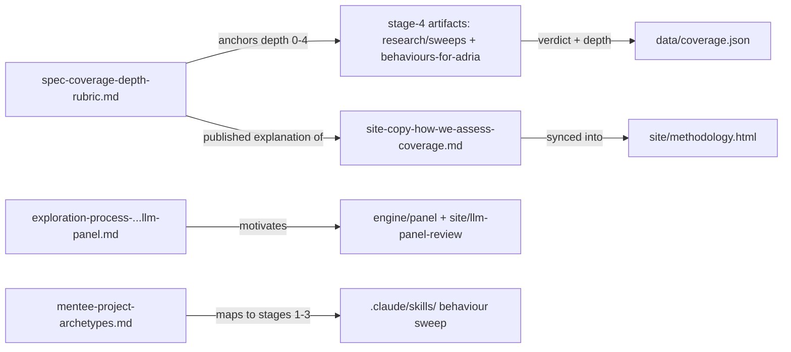

# methodology/ — scoring rubrics, site methodology copy, and exploratory method write-ups

> As-is snapshot of origin/main @ 31fddca (2026-08-17). Describes what exists now, not what should exist.

## Purpose
The methodological backbone for the coverage side of the index: the rubric that anchors every 0–4 depth score, the public-facing copy that explains how coverage is assessed, and two exploratory/forward-looking documents (the lexical→semantic→panel method exploration, and mentee project archetypes).

## Contents
| Path | Holds |
|---|---|
| `spec-coverage-depth-rubric.md` | The canonical depth rubric: 5-level anchor table (0 absent / 1 named / 2 discussed / 3 prescribed / 4 demonstrated), boundary tests (2v3 grading test, 3v4 worked-example test, "dedicated section is evidence not requirement", "scored on core excerpts", "independent of authority level"), and a precedent table re-checking all six behaviour-1/2/3 scores |
| `site-copy-how-we-assess-coverage.md` | Editable working copy of the "How we assess coverage" section published on `site/methodology.html`; explains pinned verbatim citations, term-sweep method, core/related passages, and a worked no-sycophancy example deriving the published depth scores |
| `exploration-process-lexical-semantic-llm-panel.md` | Findings doc comparing three passage-linkage methods (lexical filtering, semantic embeddings with metric tables, panel of LLM judges) and why lexical and embedding approaches were dropped in favour of the panel |
| `mentee-project-archetypes.md` | Provisional (2026-07-21) shape of mentee/SPAR contributions on the evidence layer: four archetypes (A1 audit, A2 reproduction, A3 convergent validity, A4 new-facet eval) plus a per-behaviour suitability map for behaviours 1–13 |

## Relationships
`spec-coverage-depth-rubric.md` is the source of the `depth_0_4` values in `data/coverage.json` and is cited by every stage-4 artifact (`research/sweeps/*/4-spec-coverage.md` and all ten `behaviours-for-adria/*/4-spec-coverage.md`). `site-copy-how-we-assess-coverage.md` is the working copy synced into `site/methodology.html` (the HTML is the published source). The exploration doc motivates the panel approach implemented in `engine/panel/` and surfaced via `site/llm-panel-review/`. `mentee-project-archetypes.md` maps onto the sweep pipeline (A1 = stages 1–3 of `.claude/skills/`) and the behaviour list in `research/core-behaviour-list.md`.

## Dependency map

## As-is observations
- The rubric's canonical location is `methodology/spec-coverage-depth-rubric.md`. The two `research/sweeps/03-action-honesty/` records reference it by its earlier `research/` path, annotated with the current location.
- Root `README.md` and `PLAN.md` repo maps do not list `methodology/` as a top-level directory.
- `mentee-project-archetypes.md` is self-declared provisional and notes "the repo copy of `core-behaviour-list.md` predates the 'Interaction with others' group and is stale for rows 11–13" — its behaviour numbering anticipates a list newer than the one committed.
- The exploration doc and mentee doc are forward-looking/decision records, not consumed by any build or render step; only the depth rubric and the site copy have live downstream consumers.
- The site copy references a live URL (`ai-character-index.pages.dev/methodology`) and states the full per-behaviour reports "will be published in the following weeks" — a publication-status claim embedded in the copy.
