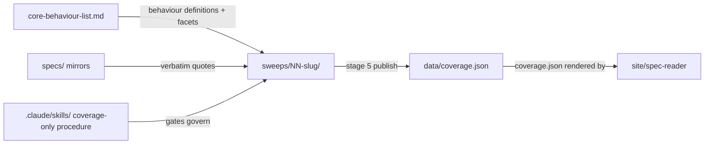

# research/ — the index's intellectual core: canonical behaviour list plus per-behaviour sweep records

> Current-state doc: describes what exists now, not what should exist. Brought current with the Phase-2 stack (#28–#34).

## Purpose
Defines the behaviours the index measures (`core-behaviour-list.md`) and holds the working records of spec-coverage sweeps (`sweeps/`) that feed `data/*.json` and, through it, the site. Candidate-pool provenance (`sources/`) and the evidence-discovery sweep stages 1–3 were retired by the scope ruling (2026-08-19).

## Contents
| Path | Holds |
|---|---|
| `core-behaviour-list.md` | Canonical list: 12 behaviours (10 Tier 1, 2 Tier 2) + parked table; inclusion criteria; per-behaviour spec-coverage blocks and eval facets; stated as kept in sync with the Notion "Behaviours to track" page |
| `archive/behaviours-to-track.md` | Earlier draft, superseded 2026-07-10; 13 rows with older numbering/titles |
| `sweeps/01-no-sycophancy.md` | Full-sweep canonical write-up (2026-07-12, pre-staged-layout): RAND rubric operationalization (15 items D1–Do7), verbatim spec excerpts, 5 curated evals, adherence table, Appendix A verdict matrix, epistemic status; named the stage-5 content template |
| `sweeps/01-no-sycophancy/` | Behaviour 1's staged folder after the scope ruling: reconstructed `4-spec-coverage.json` sidecar (built from the 20 published citations, so the records are regenerable) + `gates.md`; the stage-1 artifacts (`1-dossiers.md`, `register.md`) were deleted |
| `sweeps/02-calibration/` | Stage 4 only: `4-spec-coverage.md` (verdicts covered, constitution 3 / model spec 4) + `gates.md` (Gate 4 signed 2026-07-20) |
| `sweeps/03-action-honesty/` | Stage 4 only, same shape (constitution 3 / model spec 3), Gate 4 signed 2026-07-20 |

## Relationships
Sweeps take their behaviour definitions from `research/core-behaviour-list.md` and quotes from the `specs/` mirrors via `specs/CITATION.md` + `engine/spec-cite/cite.py`. The coverage-only procedure lives in `.claude/skills/` (`4-sweep-spec-coverage` → `5-sweep-publish` → `6-sweep-verify`, plus the `spec-coverage-pass` campaign); evidence-discovery stages 1–3 were retired by the scope ruling. Stage 5 publishes approved artifacts to `data/coverage.json` (the 02/03 Gate-4 entries authorized a scoped publish via `engine/publish-coverage.py` ahead of stages 1–3); `site/spec-reader/` renders `coverage.json` (via `documents.json`). `site/index.html` renders hand-maintained inline data and reads nothing from `data/`. `behaviours-for-adria/` is a separate stage-4 batch that explicitly does not feed `research/` or `data/coverage.json`.

## Dependency map

## As-is observations
- The two `sweeps/03-action-honesty/` records (`gates.md`, `4-spec-coverage.md`) reference the rubric by its earlier `research/spec-coverage-depth-rubric.md` path, annotated with the current location `methodology/spec-coverage-depth-rubric.md`.
- Behaviour 1 exists twice: the standalone write-up (`01-no-sycophancy.md`, still the stage-5 content template) and the staged folder, which now holds the reconstructed sidecar + gates (stage-1 artifacts deleted by the scope ruling). No `2-curation.md` or `3-scores.md` exists anywhere in `sweeps/` (stages 1–3 retired).
- Only behaviours 1–3 have sweep folders on main; there is no `04-instruction-hierarchy` although behaviour 4 is Tier 1 (an untracked stage-4 working record for it exists locally — see `experiments-branches.md`).
- `data/coverage.json` covers only behaviours 1–3 (6 rows). Behaviour identity is registry-driven (`data/behaviours.json`); `data/evals.json` was retired by the scope ruling.
- `methodology/mentee-project-archetypes.md` states `core-behaviour-list.md` is stale vs Notion for rows 11–13 (Notion has an "Interaction with others" group absent here).
