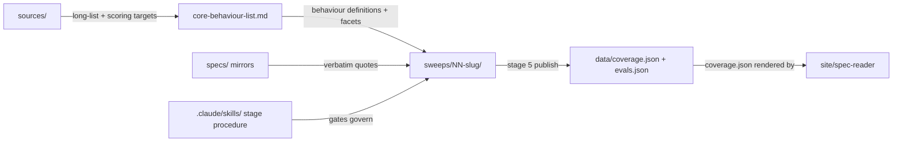

# research/ — the index's intellectual core: canonical behaviour list plus per-behaviour sweep records

> As-is snapshot of origin/main @ 4fe2dac (2026-08-18); the documentation set itself is added by this PR. Describes what exists now, not what should exist.

## Purpose
Defines the behaviours the index measures (`core-behaviour-list.md`), their provenance (`sources/`), and holds the working records of evidence and spec-coverage sweeps (`sweeps/`) that eventually feed `data/*.json` and, through it, the site.

## Contents
| Path | Holds |
|---|---|
| `core-behaviour-list.md` | Canonical list: 12 behaviours (10 Tier 1, 2 Tier 2) + parked table; inclusion criteria; per-behaviour spec-coverage blocks and eval facets; stated as kept in sync with the Notion "Behaviours to track" page |
| `archive/behaviours-to-track.md` | Earlier draft, superseded 2026-07-10; 13 rows with older numbering/titles |
| `sources/README.md`, `sources/forethought-importance-of-ai-character-appendix-2.md` | Candidate-pool provenance (Forethought excerpt) + scoring-target table pointing at the two `specs/` mirrors |
| `sweeps/01-no-sycophancy.md` | Full-sweep canonical write-up (2026-07-12, pre-staged-layout): RAND rubric operationalization (15 items D1–Do7), verbatim spec excerpts, 5 curated evals, adherence table, Appendix A verdict matrix, epistemic status; named the stage-5 content template |
| `sweeps/01-no-sycophancy/` | Staged re-sweep (2026-07-18): `1-dossiers.md` (search log + dossiers C01–C06, N01–N12, L01–L09, K01–K04), `register.md` (32 candidates, facet-fit codes, empty Disposition column), `gates.md` (Gate 1 pending sign-off) |
| `sweeps/02-calibration/` | Stage 4 only: `4-spec-coverage.md` (verdicts covered, constitution 3 / model spec 4) + `gates.md` (Gate 4 signed 2026-07-20) |
| `sweeps/03-action-honesty/` | Stage 4 only, same shape (constitution 3 / model spec 3), Gate 4 signed 2026-07-20 |

## Relationships
Sweeps take their behaviour definitions from `research/core-behaviour-list.md` and quotes from the `specs/` mirrors via `specs/CITATION.md` + `engine/spec-cite/cite.py`. The staged procedure lives in `.claude/skills/` (1-discover → 2-curate → 3-score → 4-spec-coverage → 5-publish → 6-verify, plus the `spec-coverage-pass` loop). Stage 5 transcribes approved artifacts to `data/coverage.json` and `data/evals.json` (the 02/03 Gate-4 entries authorized a scoped publish via `engine/publish-coverage.py` ahead of stages 1–3); `site/spec-reader/` renders `coverage.json` (via `documents.json`). `site/index.html` renders hand-maintained inline data and reads nothing from `data/`; `data/evals.json` is rendered by no surface. `behaviours-for-adria/` is a separate stage-4 batch that explicitly does not feed `research/`, Notion, or `data/coverage.json`.

## Dependency map

## As-is observations
- The two `sweeps/03-action-honesty/` records (`gates.md`, `4-spec-coverage.md`) reference the rubric by its earlier `research/spec-coverage-depth-rubric.md` path, annotated with the current location `methodology/spec-coverage-depth-rubric.md`.
- Behaviour 1 exists twice: the standalone write-up (`01-no-sycophancy.md`, still the stage-5 content template) and the staged folder `01-no-sycophancy/`, which holds stage-1 artifacts only (Gate 1 unsigned). No `2-curation.md` or `3-scores.md` exists anywhere in `sweeps/`.
- Only behaviours 1–3 have sweep folders; there is no `04-instruction-hierarchy` although behaviour 4 is Tier 1.
- `data/coverage.json` covers only behaviours 1–3 (6 rows); `data/evals.json` covers only behaviour 1 (5 curated + 9 rejected, `human_reviewed: false`, sweep date 2026-07-12). The planned `data/behaviours.json` (sourced from `core-behaviour-list.md` per `data/README.md`) does not exist yet.
- `methodology/mentee-project-archetypes.md` states `core-behaviour-list.md` is stale vs Notion for rows 11–13 (Notion has an "Interaction with others" group absent here).
