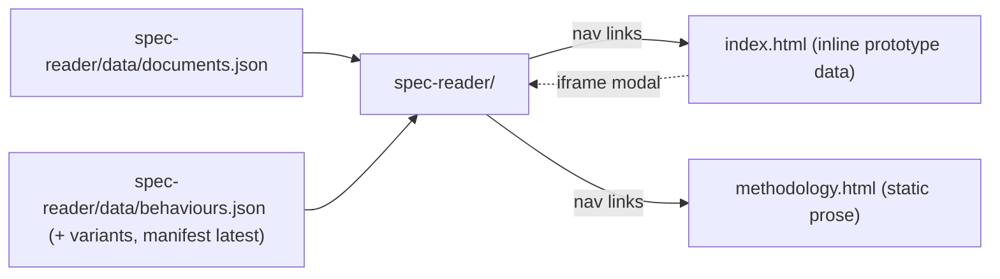

# site/ — three static surfaces, no build step, data via committed JSON payloads

> Current-state doc: describes what exists now, not what should exist. Brought current with the Phase-2 stack (#28–#41) and the reader consolidation.

## Purpose

The public presentation layer: renders engine-generated JSON payloads into static pages. Plain HTML + vanilla JS everywhere — the reader app is an ES module (`<script type="module" src="./app.js">`), while `index.html` and `methodology.html` use inline classic scripts. No framework, no build step (the Astro stack PLAN.md recommended was never adopted). Deploys to Cloudflare Pages via `.github/workflows/deploy.yml` on merges that touch `site/**`, or manually via `pnpm deploy:site`.

## Contents

| Path | What it is |
|---|---|
| `index.html` | Core-page **prototype**: all data is inline JS (`const B = {...}`, `const GROUPS = [...]`); only behaviour 1 carries real coverage data, the rest are labeled illustrative placeholders. Embeds `spec-reader/` in an iframe modal. Hand-maintained copy of `design/prototypes/core-page.html`; the two have diverged. |
| `methodology.html` | Static prose page. Describes coverage assessment: the LLM panel procedure as operative, the fixed term-list search as the predecessor that produced behaviours 1–3. |
| `spec-reader/` | The spec reader: both specifications in full with a behaviour menu over them (checklist, multi-select, compare view), each citation carrying raw per-judge verdicts scored client-side into tiers (defining / core / related band toggles). Spec text from its own `data/documents.json` (built by `engine/build-spec-reader-data.py`); behaviour data from its own `data/behaviours.json` (built by `engine/panel/build_site_data.py`), resolved ?data=<name> pin -> `data/manifest.json` latest -> that shipped fallback. `data/` also holds the calibration variants (v3w-fresh / v4a / v4a-ds / v5 / v5-1) and the band-filtered keep-set (`behaviours-v5-reader.json`) side by side, each loadable as a `?data=` pin. |
| `README.md` | Layer status; lists the three tabs. |

## Relationships

- All dynamic content arrives as committed JSON under the reader's `data/`; the deploy's `paths: site/**` filter works precisely because payloads live inside `site/`.
- Producer map: `engine/build-spec-reader-data.py` → `spec-reader/data/documents.json` (spec text; its `behaviours` key still derives from the frozen `data/coverage.json` but no surface renders it); `engine/panel/build_site_data.py` → the reader's behaviour payloads (timestamped runs + `manifest.json`, both gitignored, plus the tracked `behaviours.json` fallback), and with `--threshold=4 --solid-threshold=6` the keep-set variant (`behaviours-v5-reader.json`).
- `engine/verify-reader-test.mjs` / `verify-reader-features.mjs` are the E2E tests of this surface (repo-wide, `engine/panel/test_panel.py` covers the panel pipeline): they boot Chrome against the page and assert every renderable passage anchors (the client renders nothing below the related cut, so the committed keep-set is the count oracle), and `verify-reader-features.mjs` additionally exercises the URL/DOM-state features and the user-data path; they hardcode the DOM selectors used here.
- `index.html` is connected to **no** pipeline — its inline data is hand-maintained.

## Dependency map

## As-is observations

- `index.html` carries hand-maintained inline prototype data (`data/README.md` carves this exception out explicitly); `site/README.md` documents the divergence from the prototype and warns against re-copying it without reconciling. The landing-page rewrite owns that file.
- `methodology.html` describes the term-list method while the operative procedure is the LLM panel; nothing tells readers which method produced which published records (behaviours 1–3: term-list; panel-scored records live in `spec-reader/`).
- The verifiers' DOM-selector coupling means a markup refactor silently invalidates the only E2E checks.
