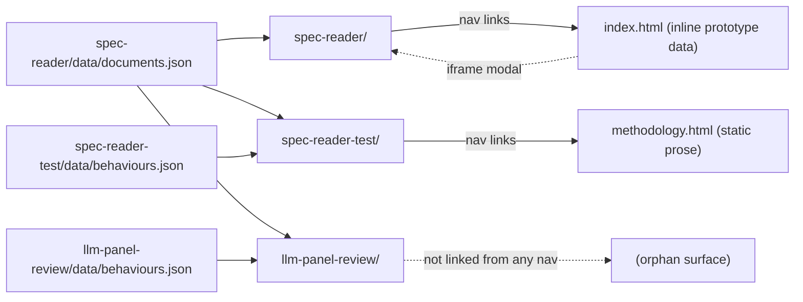

# site/ — five static surfaces, no build step, data via committed JSON payloads

> As-is snapshot of origin/main @ 31fddca (2026-08-17). Describes what exists now, not what should exist.

## Purpose

The public presentation layer: renders engine-generated JSON payloads into static pages. Plain HTML + vanilla ES-module JS everywhere — no framework, no build step (the Astro stack PLAN.md recommended was never adopted). Deploys to Cloudflare Pages via `.github/workflows/deploy.yml` on merges that touch `site/**`, or manually via `pnpm deploy:site`.

## Contents

| Path | What it is |
|---|---|
| `index.html` | Core-page **prototype**: all data is inline JS (`const B = {...}`, `const GROUPS = [...]`); only behaviour 1 carries real sweep data, the rest are labeled illustrative placeholders. Embeds `spec-reader/` in an iframe modal. Hand-maintained copy of `design/prototypes/core-page.html`; the two have diverged. |
| `methodology.html` | Static prose page. Describes coverage assessment as systematic term-list search; the operative procedure is the LLM panel. |
| `spec-reader/` | The published reader. Fetches `data/documents.json` (built by `engine/build-spec-reader-data.py`; currently behaviours 1–3). `app.js` `GROUPS` hardcodes 13 behaviours in 4 categories while the payload carries 3. |
| `spec-reader-test/` | External reviewer's bench (deliberate fork of the reader UI). Fetches the shared `../spec-reader/data/documents.json` plus its own `data/behaviours.json` (built by `engine/build-reader-test-data.py` from `data/reader-test-coverage.json`, transcribed from `behaviours-for-adria/`). Excellent README. |
| `llm-panel-review/` | Panel-judged reader: raw per-judge verdicts per passage, scores recomputed client-side (`?threshold=`/`?solid=`/`?related=`). Fetches shared `documents.json` + own `data/behaviours.json` (built by `engine/panel/build_site_data.py`). 3 behaviours × 3 judges. **Not linked from any nav.** |
| `README.md` | Layer status; tab list omits `llm-panel-review/`. |

## Relationships

- All dynamic content arrives as committed JSON under each app's `data/`; the deploy's `paths: site/**` filter works precisely because payloads live inside `site/`.
- Producer map: `engine/build-spec-reader-data.py` → spec-reader payload; `engine/build-reader-test-data.py` → test-bench payload; `engine/panel/build_site_data.py` → panel payload.
- `engine/verify-spec-reader.mjs` / `verify-reader-test.mjs` are the only tests: they boot Chrome against these pages and assert every passage anchors; they hardcode the DOM selectors used here.
- `index.html` is connected to **no** pipeline — its inline data is hand-maintained.

## Dependency map

## As-is observations

- Five surfaces, one orphan: `llm-panel-review/` is built, documented in its own README, and deployed, but unreachable from every nav and unlisted in `site/README.md`.
- `index.html` contradicts `data/README.md`'s "the site contains no data of its own" — it carries hand-maintained inline data, and the only documented update path is "re-copy the prototype and push."
- Broken anchors: spec-reader's nav points at `../#methodology` and `../#about`; `index.html` has neither anchor. Sibling apps link `../methodology.html` instead.
- `methodology.html` describes the term-list method while the operative procedure is the LLM panel; nothing tells readers which method produced which published records (behaviours 1–3: term-list; panel-scored records live in `llm-panel-review/`).
- Behaviour metadata drift: `spec-reader/app.js` hardcodes 13 behaviours while its payload ships 3.
- The verifiers' DOM-selector coupling means a markup refactor silently invalidates the only E2E checks.
