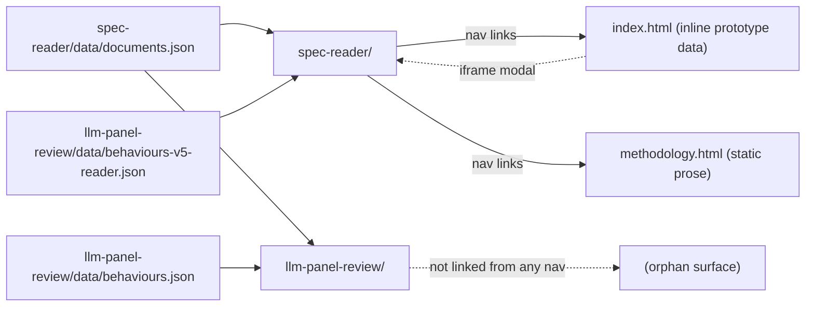

# site/ — four static surfaces, no build step, data via committed JSON payloads

> Current-state doc: describes what exists now, not what should exist. Brought current with the Phase-2 stack (#28–#41) and the reader consolidation.

## Purpose

The public presentation layer: renders engine-generated JSON payloads into static pages. Plain HTML + vanilla JS everywhere — the two reader apps are ES modules (`<script type="module" src="./app.js">`), while `index.html` and `methodology.html` use inline classic scripts. No framework, no build step (the Astro stack PLAN.md recommended was never adopted). Deploys to Cloudflare Pages via `.github/workflows/deploy.yml` on merges that touch `site/**`, or manually via `pnpm deploy:site`.

## Contents

| Path | What it is |
|---|---|
| `index.html` | Core-page **prototype**: all data is inline JS (`const B = {...}`, `const GROUPS = [...]`); only behaviour 1 carries real coverage data, the rest are labeled illustrative placeholders. Embeds `spec-reader/` in an iframe modal. Hand-maintained copy of `design/prototypes/core-page.html`; the two have diverged. |
| `methodology.html` | Static prose page. Describes coverage assessment: the LLM panel procedure as operative, the fixed term-list search as the predecessor that produced behaviours 1–3. |
| `spec-reader/` | The spec reader: both specifications in full with a behaviour menu highlighting cited passages (checklist, multi-select, compare view). Fetches its own `data/documents.json` for the spec text (built by `engine/build-spec-reader-data.py`) plus `../llm-panel-review/data/behaviours-v5-reader.json` for the behaviour data — the v5 panel run pre-filtered to the panel's band boundary (`engine/panel/build_site_data.py` with `--threshold=4 --solid-threshold=6`). The behaviour URL is a pinned literal filename: the payload is band-filtered and `data/manifest.json` is gitignored, so the reader must not resolve through the panel's manifest (`engine/verify-reader-test.mjs` asserts the pin returns 200). |
| `llm-panel-review/` | Panel-judged reader: raw per-judge verdicts per passage, scores recomputed client-side (`?threshold=`/`?solid=`/`?related=`). Fetches shared `documents.json` + own `data/behaviours.json` (built by `engine/panel/build_site_data.py`); `?data=<name>` loads a sibling payload instead (`data/` also holds the calibration variants v3w-fresh / v4a / v4a-ds / v5 / v5-1 side by side). 3 behaviours × 3 judges. **Not linked from any nav.** |
| `README.md` | Layer status; lists all four tabs, with `llm-panel-review/` noted as deployed-but-unlinked. |

## Relationships

- All dynamic content arrives as committed JSON under each app's `data/`; the deploy's `paths: site/**` filter works precisely because payloads live inside `site/`.
- Producer map: `engine/build-spec-reader-data.py` → `spec-reader/data/documents.json` (spec text; its `behaviours` key still derives from the frozen `data/coverage.json` but no surface renders it); `engine/panel/build_site_data.py` → panel payload, and with `--threshold=4 --solid-threshold=6` the reader's behaviour payload (`behaviours-v5-reader.json`).
- `engine/verify-reader-test.mjs` / `verify-reader-features.mjs` are the E2E tests of these surfaces (repo-wide, `engine/panel/test_panel.py` covers the panel pipeline): they boot Chrome against these pages and assert every passage anchors, and `verify-reader-features.mjs` additionally exercises the panel's URL/DOM-state features and the reader's user-data path; they hardcode the DOM selectors used here.
- `index.html` is connected to **no** pipeline — its inline data is hand-maintained.

## Dependency map

## As-is observations

- Four surfaces, one orphan: `llm-panel-review/` is built, documented in its own README, deployed, and listed in `site/README.md` — but unreachable from every navigation on the deployed site (local-mode adds the link once a user spec is registered).
- `index.html` carries hand-maintained inline prototype data (`data/README.md` carves this exception out explicitly); `site/README.md` documents the divergence from the prototype and warns against re-copying it without reconciling. Its nav still carries a "Reader test" item pointing at the retired surface; the landing-page rewrite owns that file.
- `methodology.html` describes the term-list method while the operative procedure is the LLM panel; nothing tells readers which method produced which published records (behaviours 1–3: term-list; panel-scored records live in `llm-panel-review/`).
- The verifiers' DOM-selector coupling means a markup refactor silently invalidates the only E2E checks.
