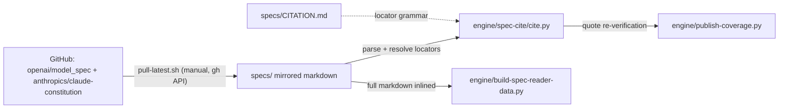

# specs/ — version-pinned mirrors of the lab specs every citation resolves against
> As-is snapshot of origin/main @ 31fddca (2026-08-17). Describes what exists now, not what should exist.

## Purpose
Local copies of the two published lab behaviour specs, pinned by version, plus `CITATION.md`, which defines the locator grammar that makes every stored quote resolvable to an exact span. Per `CITATION.md`, a locator is only valid if `engine/spec-cite/cite.py` resolves it against these files.

## Contents
| Path | Holds |
|---|---|
| `CITATION.md` | Locator format `<spec>@<version> > <section-ref> > ¶<n>[ s<a>[-<b>]]` (`>` / `›` interchangeable); section refs are `#anchor` for the Model Spec and heading-title paths for the constitution; block (¶) and sentence (s) counting rules; the three mechanical normalizations applied to quotes; cite.py command reference |
| `claude-constitution/20260120-constitution.md` | Anthropic constitution mirror, 830 lines / 184K; no `{#anchor}` syntax — cited by heading path only |
| `claude-constitution/README.md`, `LICENSE` | Mirrored upstream readme and CC0 1.0 license |
| `openai-model-spec/model_spec.md` | OpenAI Model Spec mirror, 4691 lines / 268K; 80 lines carry `{#anchor}` markers (59 also carry `authority=` tags); worked examples are `~~~`-fenced transcripts paired with `**Example**:` captions |
| `openai-model-spec/CHANGELOG.md` | Upstream changelog, v2024.05.08 → v2025.12.18 |
| `openai-model-spec/README.md` | Mirrored readme. The upstream dated `.html` release archives are deliberately not mirrored (see the spec-watch note below) |

## Relationships
Writer: `engine/spec-watch/pull-latest.sh` (run manually; needs an authenticated `gh` CLI) pulls files from `openai/model_spec` and `anthropics/claude-constitution` via the GitHub API and base64-decodes them into this directory; nothing else writes here. OpenAI's upstream `docs/` release archives (dated HTML snapshots) are deliberately not mirrored: they range 1.7–2.6 MB, beyond the GitHub contents API's 1 MB inline limit, so that endpoint can never return them. Readers: `engine/spec-cite/cite.py` parses both mirrors (headings → sections → blocks → sentences) for its `outline/show/resolve/find` commands; its `SPECS` registry pins `constitution@2026-01-20` → `claude-constitution/20260120-constitution.md` and `model-spec@2025-12-18` → `openai-model-spec/model_spec.md`. `engine/publish-coverage.py` re-resolves every stored quote through cite.py before writing `data/coverage.json`. `engine/build-spec-reader-data.py` inlines both mirrors' full markdown into `site/spec-reader/data/documents.json`. `data/labs.json` `local_copy` fields point here but are string data no code reads. The sweep files in `behaviours-for-adria/` record that the mirrors were byte-identical to upstream as of 2026-07-24/25.

## Dependency map

## As-is observations
- The pinned versions (`constitution@2026-01-20`, `model-spec@2025-12-18`) are restated in `cite.py` `SPECS`/`DEFAULT_VERSION`, `engine/build-spec-reader-data.py` `DOCUMENTS`, `data/labs.json`, and every stored locator prefix; nothing reads cite.py's registry to keep the others in sync.
- The upstream dated release archives are deliberately not mirrored: they exceed the GitHub contents API's 1 MB inline limit and arrive as 0-byte files when fetched that way. Knowing when upstream has moved past the pinned registry (version detection) is an open punch-list item and will need its own signal (e.g. a `docs/` listing or CHANGELOG diff).
- PLAN.md §1.2 and `engine/README.md` describe a weekly spec-watch Action that opens a PR when a spec changes; `.github/workflows/README.md` confirms `spec-watch.yml` is "still to come" — pulls are manual only.
- `CITATION.md` and `engine/README.md` say CI re-resolves locators against `specs/` "so a spec update that moves text fails loudly"; no such CI exists (only `deploy.yml`). Re-resolution happens only inside `publish-coverage.py` runs.
- The constitution mirror has no anchors, so its locators depend on exact heading-title paths; `CITATION.md` notes a trailing path subset resolves "when unique" today, and stored citations should carry full paths to survive future duplicate titles.
